# ORCA — Platform Architecture

**Revision A · August 2026**

---

## Status of this document

This is a **living document**. It records the architecture as currently decided, and it will change as the design is built, tested and challenged — through implementation, through the planned technical spikes, and through decisions still to be taken.

**It states what has been decided. It does not record what remains open.** Anything unsettled is held in the companion register, *ORCA — Open Questions and Clarifications*, which is maintained alongside this document and is the only place to look for it. Where a point is deliberately left to whoever implements it, it is marked **decided ad hoc** and defined in §D4.

Readers should treat any statement here as current rather than final, and should check the revision date before relying on it for a commitment. **Where this document and the companion register disagree, the register is the more recent of the two.**

## How to read this document

| Part | What it covers | Intended reader |
|---|---|---|
| **A · The solution** | What the platform does, how processes and screens are designed, multi-server operation, the technology choices and the reasoning behind each | Everyone. This part is complete in itself |
| **B · Architecture** | Context and boundaries, the seven services, how they communicate, data ownership, security and tenancy, deployment | Everyone. Technical, but not implementation-level |
| **C · Service detail** | One chapter per service: what it owns, its data, its interfaces, how it behaves when things fail | Engineers building or operating the platform |
| **D · Reference** | Decision records, external contracts in full, conventions, glossary | Engineers and architects |

**Parts A and B together are a complete account of the solution.** A reader who stops at the end of Part B will have an accurate picture of what is being built and why. Parts C and D exist to build from.

---

# Part A · The Solution

## A1 · What ORCA does

ORCA automates the gates of logistics facilities — container terminals, distribution centres, and industrial sites where trucks arrive, are identified, are processed against the operator's systems, and are released.

At a lane, the sequence is roughly this. A camera reads the plate of an arriving truck. The platform recognises the visit, and runs the process the site's own administrators designed for that lane: it asks the Terminal Operating System whether the truck is expected, reads a container seal or a scanned document, prints a ticket, raises the barrier. Where the process needs something automation cannot supply — a document that will not read, an exception the system cannot resolve — it routes the work to a clerk, tracks it against a time target, and escalates it if the target passes. Carriers pre-announce visits through a driver portal, so the truck is known before it arrives.

Two properties shape everything in this document.

**The gate must keep working when other things do not.** A truck at a barrier is a physical queue. If the platform stops, the queue does not — it grows, and it grows into the public road. So the design assumes the wide-area link will drop, that a server will fail, and that an integration will time out, and it states what happens in each case rather than leaving it to chance.

**The site's processes belong to the site.** Terminals do not run the same process, and a platform that hard-codes one is a platform that has to be modified per customer. Processes and screens are designed by the customer's own administrators, visually, without writing code — and the platform is built so that this remains true as those processes grow more demanding.

## A2 · What the platform provides

| Capability | What it means |
|---|---|
| **Gate automation** | Plate capture, barrier and printer control, IO handling, driver kiosks — one device host per lane |
| **Process automation** | Gate processes designed visually by the site's administrators, executed on **BPMN 2.0** by **Flowable** |
| **Screen authoring** | Operator and driver screens composed visually, with insert-anywhere editing, reordering and undo |
| **Clerk workflow** | Work automation cannot complete is routed, tracked against time targets, and **breaches raised** |
| **Carrier pre-announcement** | A driver portal for booking and arrival, with tickets and QR codes |
| **Terminal Operating System integration** | Bidirectional, across the customer's own network |
| **Video and intercom** | Live lane video and operator-to-driver audio |
| **Multi-server operation** | More than one server at a site, in either a standby or a load-sharing arrangement |

## A3 · How processes are designed

Gate processes are designed visually, by the site's own administration team, without writing code. This is the platform's central capability and the one customers exercise most.

**What a process can express.** The notation covers what terminal operations actually require:

- **Two steps running at the same time, then waiting for both.** A call to the Terminal Operating System and a container seal read can be issued together and joined, rather than run one after the other.
- **A defined response when a step fails or takes too long.** Timeouts and error paths are first-class, per step, and distinguish a call that failed from a call that answered late.
- **Acting on work that has been waiting too long.** A time target on a clerk task is a **timer on the process itself**, so a task that passes its target raises a breach rather than only changing a colour on a screen. This is the clearest example of the engine doing work the platform would otherwise have to build: the timer is a standard construct of the notation, not a scheduler of ours.
- **Reversing steps that already completed** when a process fails part-way through — a barrier raised and a ticket printed can be compensated.

**In practice.** A process asks the Terminal Operating System whether a truck is expected **and** reads the container seal at the same time; raises the barrier only when both have returned; and routes the visit to a clerk if the Terminal Operating System has not answered within thirty seconds. Each of those is a standard construct of the notation, not something built for the occasion.

**How it is authored, and how it runs.** Administrators work in ORCA's own visual builder — a canvas in the vocabulary of lanes, devices and visits. **Each published process is compiled to BPMN 2.0 and executed by Flowable**, a mature open-source engine embedded inside the platform. BPMN is the execution representation and the stored definition; the builder is the authoring experience, shaped for the people who use it rather than for process-modelling specialists.

**What that combination gives the customer.** Process definitions in an international standard notation that the customer's own architects can read and that other tools can open. An execution engine with a large installed base and an established pool of people who know it. And an authoring surface an administrator can be productive in without first learning formal process modelling.

> **A design consequence, stated openly.** Because the builder and the engine use different representations, a compiler sits between them, and it is permanent: every node type the builder offers must have a faithful BPMN compilation for the life of the product. A conformance harness compares each published definition against its compiled process and runs as a standing regression gate. This is a deliberate cost, accepted so that administrators are not required to model in BPMN directly.

## A4 · How screens are designed

Operator and driver screens are composed visually from a library of components — fields, panels, tables, actions, media — and bound to the data a process carries.

**Editing is a first-class operation.** Each element carries a permanent identity of its own, independent of its name and its position on the screen. That single property is what allows an element to be inserted anywhere, dragged into a different order, and undone. It also means renaming a field does not break the rules that refer to it, because those rules follow the element rather than its name.

The editor presents an outline of the whole screen alongside the canvas, so nested elements can be located and selected directly rather than hunted for.

**One renderer.** A screen appears the same in the builder as it does to an operator and to a driver at a kiosk, because a single implementation draws it in all three places. The set of available components is defined by one registry, which every renderer imports rather than reimplements.

**Screens are versioned.** Publishing a screen writes an immutable version. A visit already in progress continues to see the version it started with, so an administrator editing a screen at two in the afternoon cannot change what a truck mid-process is looking at. New visits bind to the current version, and rolling back is republishing an earlier one.

## A5 · Multi-server operation

The platform runs as more than one server at a site. Sites differ in how much interruption a gate can absorb, so the arrangement is chosen per site.

**How it works.** The platform holds its coordination in the database rather than inside a running program. Every instance sees the same state, and the database decides which instance takes each piece of work. A visit interrupted by a restart continues from the step it had reached rather than needing manual recovery.

Both arrangements are supported: **a standby server that takes over when the primary fails**, and **two servers sharing the load**.

*Two servers at one site. Both claim work from the same database; only the connection to a lane's hardware is held by one at a time.*

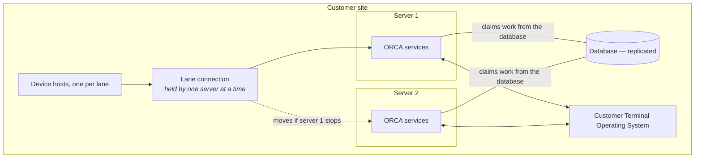

**One characteristic to be clear about.** Cameras and device hosts each talk to a single fixed network address. The connection to a lane's hardware is therefore held by **one server at a time**, and moves to the other if that server stops. Everything else — operator screens, clerk work, calls to the Terminal Operating System, the driver portal — runs on both servers at once.

**What that means at the gate.** If a server fails, the lane's hardware connection transfers to the surviving server and processing continues. It is a transfer rather than a seamless handover, and how long it takes depends on how the site is configured.

**Moving that address is a facility of the customer's network** — a floating address or a short-lived DNS record — rather than something the platform provides. It is named in the pre-install requirements, and it needs the customer's network team. Where a site cannot provide it, the multi-server arrangements are not available at that site. This is deliberate: keeping address failover out of the application is what allows the application itself to stay simple.

**Promotion is manual.** Two servers cannot safely arbitrate between themselves which of them is live — with only two votes there is no majority, and an automatic promotion can leave both believing they are primary. A human promotes. Where a site wants unattended promotion, it needs a third vote, and that is a topology decision taken with the customer rather than a property of the platform.

## A6 · The technology, and the reasoning behind each choice

| Layer | Choice | Why |
|---|---|---|
| **Application platform** | **Java 25 · Spring Boot 4** | The mainstream enterprise Java stack on a long-term-support release. A large hiring pool, and a stack any enterprise IT function already recognises and can resource |
| **Process automation** | **BPMN 2.0**, executed by **Flowable** | An international standard for describing business processes, and a mature open-source engine embedded in the platform. No separate component to install or operate, and no licence fee |
| **Database** | **SQL Server** | The engine most terminal IT functions already run, back up and monitor. The platform is written against one engine seam so a second engine remains possible, but only SQL Server is built and tested |
| **Identity** | **Keycloak** | Standard OpenID Connect, with single sign-on against the customer's existing directory. Identity is not something to build |
| **Services** | **Seven** | Small enough that one engineer can hold the whole picture; separated where a fault in one part must not reach another |
| **Messaging** | **None to install** | Work is handed between services through the database, which is already present, already backed up, and already understood by the customer's database administrators. There is no message broker to run at a site |

**The last row is a deliberate simplification and worth stating plainly.** A site runs the platform, a database, an identity server and a reverse proxy. It does not run a message broker, a cluster manager, or a service mesh. Every component at a site is one the customer's own operations team can reason about.

## A7 · Deployment models

The platform ships as one set of components composed three ways. **There is no separate product variant per model.**

| Model | Description |
|---|---|
| **Site appliance** | The complete platform runs on the customer's own hardware, inside the customer's network. **The primary model** |
| **Hybrid** | A site paired with a hosted tier. Required where a carrier-facing driver portal is offered, since a portal must be reachable from the internet |
| **Thin edge** | Only the hardware-facing service runs at the site, with the rest in a hosted tier. For small or satellite gates where a full appliance is not justified |

### The site appliance

All components run on hardware owned and controlled by the customer, inside the customer's network. **Gate operations continue with no internet connection.**

*The physical gate on the left, the platform in the middle, the customer's own system on the right. Everything shown is inside the customer's network.*

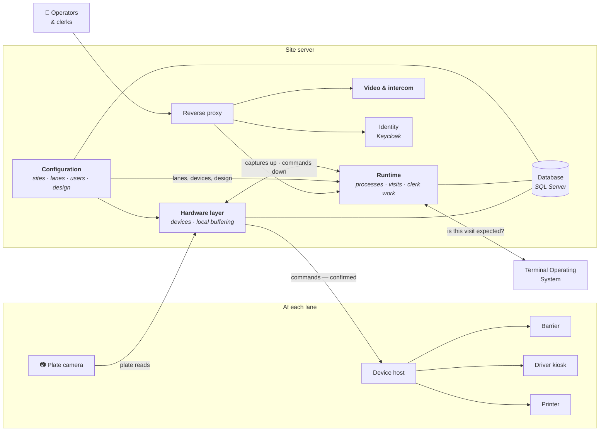

**Reading the diagram.** The physical gate is on the left, the platform in the middle, and the customer's own system on the right. Everything shown sits inside the customer's network.

- **The camera talks to the platform directly** — it speaks its own protocol to the hardware layer, not through the device host.
- **The device host is the only thing that touches the barrier, kiosk and printer.** The platform sends it a command and treats the command as complete only when the device host confirms it acted.
- **Operators reach the platform through the reverse proxy**, which is also what terminates TLS on the site network.
- **Three services share one database** — each writing only its own schema (§B5).

**Two services are absent from this model by design.** The driver portal does not run here, because a carrier-facing portal has to be reachable from the internet — that is the hybrid model. Replication does not run here either, because there is no second tier to replicate to.

**The names in this diagram, and the service names used in Part B:**

| In this diagram | Service | Chapter |
|---|---|---|
| Configuration | `orca-core` | C1 |
| Runtime | `orca-runtime` | C2 |
| Hardware layer | `orca-edge` | C3 |
| Video & intercom | `orca-media` | C7 |

**The Terminal Operating System integration runs across the customer's own network.** ORCA calls it directly; it does not route through a hosted service to do so.


### Hybrid, and thin edge

*The same components, composed differently. Nothing is built twice.*

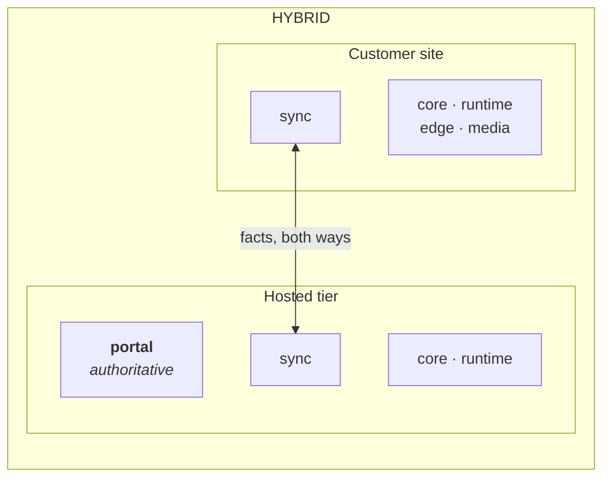

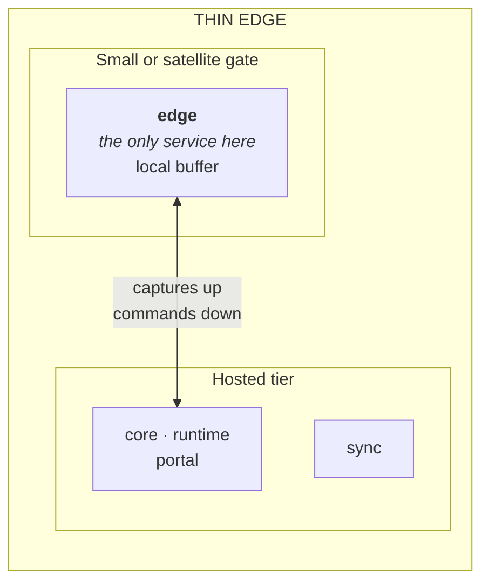

**Hybrid** pairs a site with a hosted tier. The driver portal is authoritative in the tier, because a carrier-facing portal must be reachable from the internet; the site holds enough of a replica to validate a ticket when the link is down.

**Thin edge** runs only the hardware-facing service at the gate, with a local buffer, and is driven by a runtime in the tier. Replication is embedded inside edge rather than run as its own process — there is no second service at the site for it to serve.

**One instance per site is the thin-edge limit.** A thin edge holds its own buffer locally and does not share a coordination table with a peer, so a second thin-edge instance at the same gate is not a supported arrangement.

---

# Part B · Architecture

## B1 · Context and scope

The platform sits between the physical gate and the customer's business systems.

*Everything in the outer ring is outside the platform's control. Each connection is a contract the platform adapts to.*

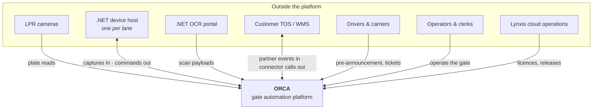

**Everything in the outer ring is outside our control**, and each connection is a contract we adapt to rather than define. §B2 states which of those contracts are fixed and why.

## B2 · What the platform connects to

Four interfaces are **fixed by what sits on the other side of them.** The platform reproduces each exactly; none is ours to change.

| Interface | The other side | Why it is fixed |
|---|---|---|
| **LPR camera protocol** | Camera firmware | The protocol belongs to the camera vendor and is burned into units already mounted at gates. We cannot update a camera, so the listener speaks its dialect exactly |
| **Device-host REST**, both directions | The .NET device host, one per lane | A field-proven vendor component that loads a driver plugin per device. Changing this contract would mean re-certifying every device vendor — the single largest avoidable cost in the programme |
| **OCR portal intake** | The .NET OCR portal | Another external component, whose image hand-off assumes a shared filesystem path — tying the contract to deployment layout as well as to the wire format |
| **Outbound connector semantics** | The customer's TOS / WMS | The customer's own system, which we cannot ask to change. The platform must **support** REST and SOAP with four authentication modes and per-connector certificate trust |

**Everything else is designed for the target**, including the partner event API, the licence file format, the driver-portal identifiers, the media port ranges and the identity realm structure. Where a design is retained unchanged it is because it works, not because it is fixed.

> **Note on transport security.** The per-connector TLS option installs a custom trust store for verifying the *server* certificate — one-way TLS. Where a customer requires mutual TLS, it is added work, not a configuration setting.

## B3 · The seven services

*Which services run where, and which talk to which. Arrows are dependencies, not data volume.*

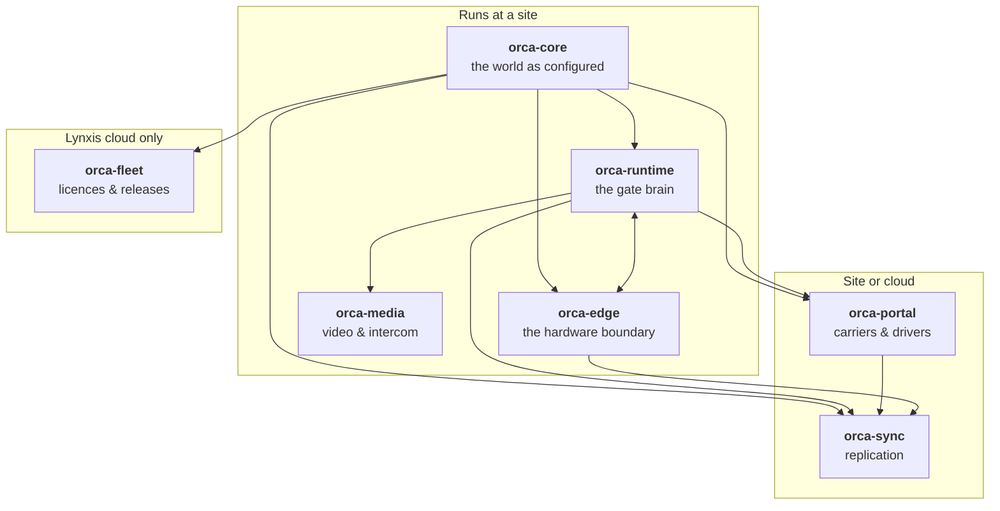

| Service | What it owns | Why it is separate |
|---|---|---|
| **orca-core** | The world as configured: tenancy, sites and lanes, users, devices, workflow and screen design, custom entities, licence verification | **Rate of change and blast radius.** Configuration changes rarely and is read constantly; a fault here must not reach the gate loop |
| **orca-runtime** | The world as it happens: the process engine, visits, work items, connectors, the partner API, notifications, operator grids, lane commands | **Transaction cohesion.** These things commit together. Splitting them would put a network hop inside a transaction that must not have one |
| **orca-edge** | Every hardware contract, the durable event buffer, the command log | **Placement and contract isolation.** It is the only component a thin-edge site needs, and it is where all hardware-specific behaviour is contained |
| **orca-portal** | Carriers, drivers, tickets and QR codes, appointments | **Security zone and a different tenancy model.** It is internet-facing, it holds driver personal data, and carriers legitimately span customers |
| **orca-sync** | Replication between a site and a cloud tier | **Existence condition.** It only exists where two tiers are paired |
| **orca-fleet** | Licence issuance and signing, the fleet registry, artifact distribution | **Security by structure.** Signing keys cannot ship on a customer's box |
| **orca-media** | Video relay, streaming, intercom signalling | **Blast radius, and it already works.** Specialised real-time technology, delivered in the technology suited to it |

**Six services are built on Java 25 and Spring Boot 4. orca-media is delivered in its existing technology** — real-time media is a specialism, and rewriting a working relay buys nothing.

## B4 · How services communicate

**Five mechanisms are permitted between services. Nothing else is.** Each exists because a different guarantee is needed, and using the wrong one is how distributed systems decay.

| # | Mechanism | Use it for | What it guarantees | What it cannot do |
|---|---|---|---|---|
| **1** | **In-process module events** | Inside orca-runtime only, between its modules | Transactional with the publishing step — the event and the data commit together or not at all | Cross a process boundary |
| **2** | **Read-only views onto core's world model** | Any service reading configuration | Same-transaction consistency, no network hop, no latency on the gate path | Be written to, or carry anything core has not published |
| **3** | **Synchronous REST** | Device commands, ticket validation, deployment push | A deadline, an idempotency key and a bounded retry | Survive the callee being down |
| **4** | **Transactional outbox → feed → apply** | Every cross-service and cross-tier *fact* | At-least-once delivery, ordered per key, acknowledged per consumer | Deliver instantly |
| **5** | **WebSocket push** | Console live updates | Best effort, and nothing more | Be relied upon — the underlying query is authoritative on reconnect |

*How a fact travels, and why it cannot be lost or published twice.*

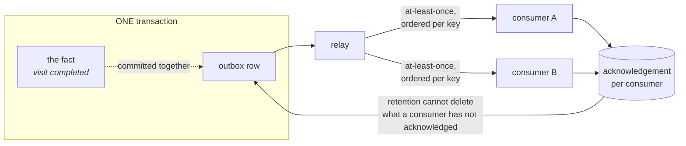

**Mechanism 4 is what replaces a message broker.** A service writes the fact and its outbox row in one transaction, so a fact cannot be published without being recorded, nor recorded without being published. A relay reads the outbox and offers it to each registered consumer until acknowledged. The guarantee is the same one a broker gives; the operational cost is a database table instead of a server to run, patch and monitor.

## B5 · Data ownership

**One database. Seven schemas. Each table is written by exactly one service, and that is enforced by database credentials rather than by convention** — a service's login can only reach its own schema.

| Schema | Owner | Holds |
|---|---|---|
| `core` | orca-core | Tenancy, sites, lanes, users, devices, design artifacts, custom entities |
| `runtime` | orca-runtime | Executions, visits, work items, connectors, payload storage |
| `edge` | orca-edge | Device state, the capture buffer, the command log |
| `portal` | orca-portal | Carriers, drivers, tickets, appointments |
| `sync` | orca-sync | Replication cursors and bookkeeping |
| `fleet` | orca-fleet | Licence issuance, the fleet registry, artifacts |
| Asterisk's own tables | orca-media | Read directly by Asterisk in its own configuration format |

Where a service needs another's data on the gate path it reads a **published view**, not the underlying table. A view is a contract: it can be changed deliberately without the owning service losing control of its own schema.

**Storage is bounded by policy.** Every table that grows with traffic carries a retention class, and how long each class is kept is a per-customer setting applied automatically. Large payloads — connector responses, scan payloads — are stored once per distinct content and referenced, rather than copied into every record that mentions them.

## B6 · Security and tenancy

**Each customer runs their own installation. One customer's data is never stored alongside another's.** That is the platform's strongest isolation property, and it is structural rather than enforced: there is no second customer in the database to isolate from. The largest configuration is one customer operating several sites.

Within that, three different things need enforcing, and they are genuinely different problems:

| What is being enforced | Where | Nature |
|---|---|---|
| An operator entitled to one site must not read another — one customer, several sites | Site appliance | **Authorization**, not tenancy |
| One customer's data must not reach another | ~~Hosted tier only — the only place two customers share infrastructure~~ **Narrowed 7 Aug 2026 (NEW-1b): the cloud tier is per-customer**, so no database anywhere holds two customers — except the portal, whose cross-customer principals are the row below | ~~Tenancy, enforced by the database~~ **Largely dissolved by the per-customer ruling**; what remains of it is the portal's ownership model |
| A driver or carrier sees their own bookings across every terminal they visit, and nobody else's | Driver portal | **Ownership of a principal.** Carriers legitimately span customers, so a tenant rule cannot express it |

**The architectural requirement is the same in all three cases, and it is not negotiable:**

> **Scope is enforced in one place, applied by construction, with a build-time check that fails when a query bypasses it.** No query carries its own scoping condition.

That requirement is settled. **The mechanism that satisfies it in each case is owned by the security design** and is recorded in — a shared query filter, a database policy, or a different construct, decided per case by the named owner rather than per query by whoever is writing one.

**Authentication is Keycloak**, through OpenID Connect, with single sign-on against the customer's directory. Every service validates tokens by signature locally rather than calling out to check them.

**Keycloak authenticates people, not services.** A token is required of a caller acting for a user — an operator at a console, a driver in the portal, a customer's own system on the partner API. **Service-to-service calls do not carry a Keycloak token.** They present a per-installation shared credential, verified locally by the receiving service with no identity provider involved on the request path.

This is a deliberate narrowing of "OpenID Connect everywhere", and the reason is availability rather than simplicity. Token *validation* is local signature verification and survives an outage; token *issuing* always requires Keycloak to be reachable, and no caching strategy fixes that. A design in which one service must mint a token to call another makes the gate loop depend on the identity provider being up — which is precisely what §A1 says the site must not depend on.

**What that does not relax.** Internal calls are still authenticated. "Internal" is a property of a deployment, not of a service, and two profiles in §B7 make it false: on **thin edge** the command call that raises a barrier crosses the wide-area link, and on **hybrid** replication crosses a tier boundary. An unauthenticated actuating endpoint on either is reachable by anything that can route to the host. The credential is only as strong as the transport it travels over, so any hop that leaves the host is over TLS terminated by the site's reverse proxy.

**Every entry point that runs without a user — a relay, a scheduled job, a reconciler — enters an explicit system context.** There is no path that runs with no identity at all. This is internal attribution and is independent of Keycloak: it is what names the actor in an audit trail, where the shared credential only establishes that the caller is one of ours.

**Licensing.** A licence is a signed artifact issued by Lynxis operations, verified **locally** at startup — no runtime path ever calls a Lynxis service to validate it. It records what the installation is entitled to run, including how many instances may be active at a site — and that limit is the enforcement: instances arbitrate through the database lease, an instance beyond the licenced count cannot acquire the right to work, and a cold standby on other hardware is a supported arrangement rather than a violation. **Machine identity is telemetry carried by the heartbeat, never an enforcement input.** Renewal follows the deployment: a connected site pulls its renewed licence from fleet; an offline site receives a file and installs it through the console. *(Enforcement model ruled 8 Aug 2026 — register item 20.)*

## B7 · Deployment view

**A deployment profile says which components run at an installation. It does not say how many instances of each.** Those are two independent axes, and the platform is designed for more than one instance in every profile.

| Profile | What runs | For |
|---|---|---|
| **Site appliance** | Everything: core, runtime, edge, media, plus the database, identity and a reverse proxy | The primary model — a server at the customer's facility that keeps gates moving with no internet at all |
| **Hosted tier** | Everything except the hardware-facing service, which has no hardware to face | Paired with sites, and serving the driver portal |
| **Thin edge** | The hardware-facing service alone, with a local buffer | Small or satellite gates, with the rest of the platform in a hosted tier |

**Upgrades.** Where a site runs more than one instance, the platform supports a rolling upgrade — one instance at a time, with the other serving. This requires that a schema change be compatible with both versions for the duration of the upgrade, which is a discipline on how migrations are written rather than a feature.

**A single-instance site takes a short planned outage to upgrade.** That is stated rather than engineered around: a site that needs zero-downtime upgrades needs a second instance.

## B8 · Conventions that hold everywhere

| Convention | Rule |
|---|---|
| **Identifiers** | Every entity carries an internal key and an external identifier. Interfaces use the external one; internal joins use the key |
| **Idempotency** | Every command carries a key, and the same command applied twice has the effect of one |
| **Time** | The database's clock is the reference for anything two instances must agree on |
| **Compatibility** | A service must interoperate with the previous version of its peers for the duration of an upgrade |
| **Deletion** | Records are retired rather than removed, except where a retention policy deletes them deliberately |
| **Failure** | Every external call has a deadline and a defined outcome when it is exceeded. No call waits indefinitely |
| **Errors** | One response shape everywhere, with a machine-readable code a caller can branch on. Internal detail is never returned to a caller |

---

*Parts C and D follow. Part C carries one chapter per service — what it owns, its data, its interfaces, and how it behaves when things fail. Part D carries the decision records, the external contracts in full, and the glossary.*

*ORCA — Platform Architecture · Revision A · August 2026. Companion: **ORCA — Open Questions and Clarifications**.*

## B9 · How it works, end to end

Five scenarios that between them exercise every mechanism in §B4. Each ends with **what goes wrong**, because the failure path is the part that decides whether a design survives a gate.

### A truck through a lane

*The path a truck takes when nothing goes wrong — and the one place a lock is held.*

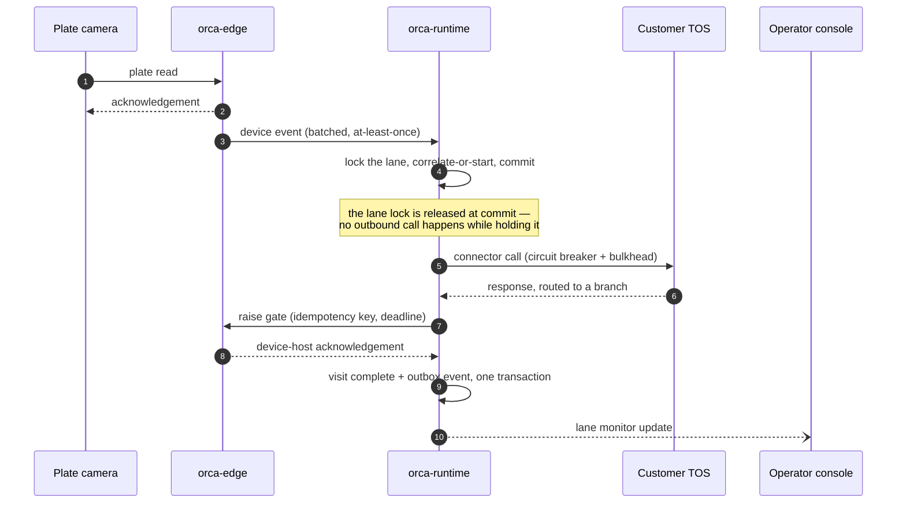

**When it goes wrong.** A slow customer system cannot queue trucks behind it — the breaker opens and the process takes its failure branch. If the gate command's outcome is unknown, the device's actual state is verified rather than assumed.

### An exception becomes a work item

*How a step automation cannot finish becomes human work, and how two operators racing for it resolve.*

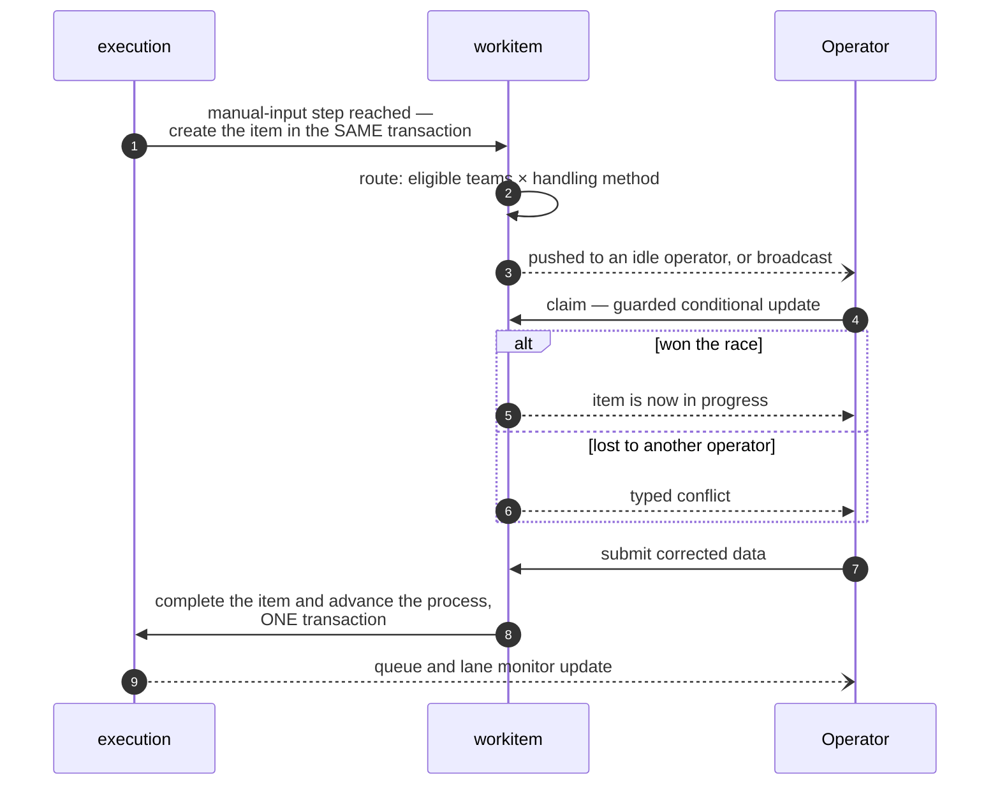

**Why this shape matters.** Creating the item and advancing the process are each a single transaction, so neither can half-apply: there is no state where the console believes an item is done and the engine does not.

**When it goes wrong.** An operator claims an item and abandons it. The time target on the step is a timer on the process, so the breach is raised rather than waiting for someone to notice.

### A device command

Commands are the one place the physical world can contradict the database, so the design is deliberately conservative — synchronous, idempotent, and never queued.

| Step | What happens |
|---|---|
| 1 | Runtime commits the step as command-issued and **releases every lock**. No external call happens inside a transaction |
| 2 | Runtime calls edge with a command identifier and a deadline |
| 3 | Edge deduplicates on that identifier, calls the device host on the frozen contract, and records the outcome and the host's response |
| 4 | Acknowledged ⇒ executed. Host error ⇒ failed. Deadline passes with no answer ⇒ **unknown** |
| 5 | A replay of a finished command returns its **recorded outcome**, never a bare duplicate |
| 6 | A replay of a command still in flight returns **in progress** — a wire status, and **not terminal**. The caller keeps waiting for the real outcome |

**When it goes wrong.** The dangerous case is a host that *did* raise the gate but answered slowly. Returning "duplicate" with no outcome would fail a step that physically succeeded — which is why a replay returns the recorded outcome, and why an in-flight replay is not treated as an answer.

### A site and hosted tier replication round trip

*One fact leaving a site and being applied by its owner in the hosted tier.*

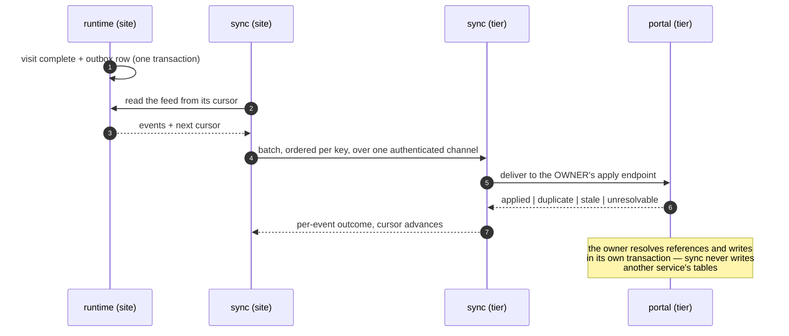

**The rule that makes this safe.** Single writer per entity class. There is no path where both tiers write the same class, so no conflict has to be adjudicated.

**When it goes wrong.** The link drops. Both tiers keep operating, and the cursor resumes where it stopped. Retention cannot delete anything the peer has not acknowledged, so an outage cannot silently destroy unreplicated data.

### Publishing a process

*What happens when an administrator presses publish.*

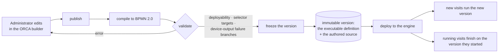

**The stored artifact is BPMN**, alongside the authored source that produced it. Keeping both means a published process can be executed by the engine and re-opened in the builder without either being derived from the other at read time.

**When it goes wrong.** A validation error is seen by the author at publish time and nothing ships. A process already running is unaffected by a publish — it finishes on the version it started.


## B10 · What this architecture guarantees

A design is only as good as the failures it makes impossible. Each property below is a claim the architecture must hold to, the mechanism that delivers it, and **how it is verified** — because a guarantee nobody can test is a hope.

### Nothing in flight is lost

| Guarantee | Mechanism | How it is verified |
|---|---|---|
| **A visit survives a restart** | No work in progress is held in a running process. Coordination is database-held, and a visit resumes from the step it had reached | Kill an instance mid-visit and assert the visit completes |
| **A timer survives a restart** | Timers are engine state in the database, not scheduled in memory | Park a process on a timer, restart, assert it fires once |
| **A device event survives a link outage** | Edge buffers durably, per lane, in order, and drains when runtime returns | Sever the link for an hour under load, assert zero loss and preserved order |
| **A fact survives a tier outage** | The fact and its outbox row commit together, so one cannot exist without the other | Assert no code path writes a fact without its outbox row |

### Nothing half-applies

| Guarantee | Mechanism | How it is verified |
|---|---|---|
| **Creating human work and advancing a process cannot disagree** | Both happen in one transaction inside one service — there is no network hop between them | A fault injected between the two must roll back both |
| **A command is never applied twice** | Every command carries an idempotency key; a replay returns the recorded outcome | Replay every command type, assert the recorded outcome rather than a duplicate |
| **A replicated fact is never applied twice** | Applied keys are recorded, not assumed | Deliver the same batch twice, assert identical state |

### Exactly one of the things that must be one

| Guarantee | Mechanism | How it is verified |
|---|---|---|
| **One truck, one visit** | Admission is a single atomic correlate-or-start, and every inbound path uses the same one | Two events for one truck in the same millisecond, from two instances, 1,000 times — one visit each time |
| **One owner of a lane's hardware** | A lease with a fence token; a holder that loses it cannot complete a write | Expire the lease mid-write, assert the write is rejected |
| **One writer per entity class** | Replication applies only through the owner's endpoint | Assert no service writes another's tables |

### Nothing grows without bound

| Guarantee | Mechanism | How it is verified |
|---|---|---|
| **Every table that grows with traffic has a retention class** | The class list is closed and enumerated | A build-time check fails on any traffic-growing table with no class |
| **Large bodies are stored once** | Content-addressed storage, referenced rather than copied | Assert a repeated payload occupies one row |
| **Retention cannot destroy unreplicated data** | A row is purge-eligible only when every registered consumer has acknowledged **and** its window has elapsed | Hold a consumer back, assert nothing is purged |

### Nothing leaks

| Guarantee | Mechanism | How it is verified |
|---|---|---|
| **A query cannot silently escape its scope** | Scope is applied in one place, by construction | A build-time check fails on any query that bypasses the seam |
| **No path runs with no identity** | Every entry point without a user enters an explicit system context | Assert every scheduled job, relay and reconciler enters it |
| **Internal detail never reaches a caller** | One response shape, machine-readable codes, no stack traces or schema | Assert no error path returns an internal exception |

### The physical world is never assumed

| Guarantee | Mechanism | How it is verified |
|---|---|---|
| **A gate command is confirmed, not assumed** | Success is an acknowledgement *and* a decodable response. Anything else is `UNKNOWN` | Assert the unknown branch exists on every actuating step |
| **A stale command never actuates** | Commands carry an expiry and are never queued; an expired command is discarded | Delay delivery past expiry, assert no actuation |
| **An unknown outcome is resolved by looking** | The device's actual state is verified rather than the command retried | Assert no actuating step retries blindly on unknown |

### Nothing changes under a truck already moving

| Guarantee | Mechanism | How it is verified |
|---|---|---|
| **Editing a screen does not change a visit in progress** | Publishing writes an immutable version; an execution binds the version it started with | Edit mid-visit, assert the running visit is unchanged |
| **Publishing a process does not change a visit in progress** | Versions are frozen at publish; running visits finish on the version they started | Publish mid-visit, assert the running visit is unchanged |
| **A screen renders the same everywhere** | One renderer, driven by one component registry every renderer imports | A build-time check fails if a renderer omits a registry member without declaring it unsupported |

> **Two of these are claims rather than settled facts, and it is worth being exact about which.** *One truck, one visit* under simultaneous events from two instances is the property the engine choice most depends on, and it is proven by a spike before the design is committed to. *A query cannot silently escape its scope* states the requirement; the mechanism that satisfies it is owned by the security design. Every other row above is a property of the architecture as described in this document.


---

# Part C · Service detail

Each chapter follows the same shape: **at a glance**, then what the service is for and why it is separate, what it is made of, what it persists, what it exposes, and how it behaves when things fail.

**Two conventions used throughout.** A **profile** is a composition of the same images for one kind of installation (§B7) — it says which services run, not how many instances of each. A **module** is a boundary *inside* a service, enforced at build time; modules do not have their own processes and do not read each other's tables.

---

## C1 · orca-core — the world as configured

| | |
|---|---|
| **Owns** | The customer → site → area → lane hierarchy · users, roles and entitlements · the device registry · workflow and screen design · custom entities · licence verification |
| **Schema** | `core` — 77 tables plus its outbox pair. Publisher of the read-only views other services consume |
| **Profiles** | Site appliance ✅ · Hosted tier ✅ · Thin edge — not deployed |
| **Why separate** | **Rate of change and blast radius.** Configuration changes rarely and is read constantly. A fault in design tooling must not be able to stop a gate |

### What it is responsible for

| Responsible for | **Not** responsible for |
|---|---|
| The site hierarchy, and the rule that exactly one site is primary — the installation's own site, and the one the licence binds to | Executing anything. Core describes the world; runtime runs in it |
| Users, roles, the entitlement catalogue, and mapping identity-provider claims to platform permissions | Issuing tokens — that is Keycloak |
| The device **registry**: identity, addressing, IO port layout, and the parameters a device host needs to load its plugins | Talking to a device. That is orca-edge, and the separation is deliberate |
| Workflow and screen design, and the publish pipeline: validate → compile to BPMN → freeze the version → deploy | Running a process |
| Custom entities — and it is the **single controlled executor** of the schema changes they require | Letting any other service alter the schema |
| Licence verification against the local file, per route and per resource limit | Licence issuance or signing — that is orca-fleet, in the cloud |
| Being the site's client of orca-fleet: reporting the heartbeat, pulling licences, release artifacts and verification keys | Deciding what to install. Fleet offers; core reports and pulls |
| Clerk teams, memberships, routing-rule *configuration*, shift and break templates | Routing a live work item. Runtime does that, reading the published rules |

### How other services read it

Core publishes **read-only views** onto its world model. A service that needs a lane's devices, a team's routing rules or a published screen reads a view in its own transaction — no network hop, no latency on the gate path, and no ability to write.

This is mechanism 2 of §B4, and the constraint is the point: a view is a contract. Core can restructure its own tables without breaking a consumer, and a consumer cannot reach anything core has not deliberately published.

### The publish pipeline

Design artifacts are **immutable once published**. Publishing a workflow validates it, compiles it to BPMN 2.0, freezes the version — both the executable definition and the authored source — and deploys it to the engine. Publishing a screen freezes the screen artifact with its schema version.

An execution binds the versions it started with and holds them to completion. Editing a design never changes anything already running.

### Inside orca-core

#### Components

*The modules inside the service, and who calls them.*

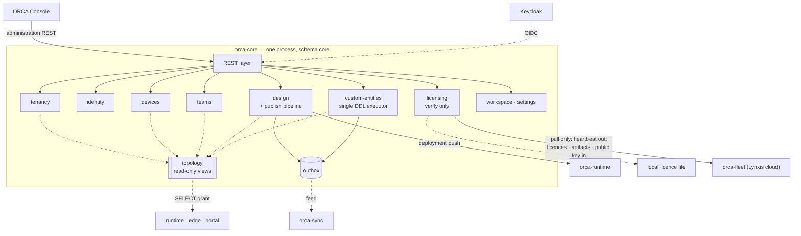

#### Data model

*The world model's core relationships. Attribute detail is defined by core's own migrations.*

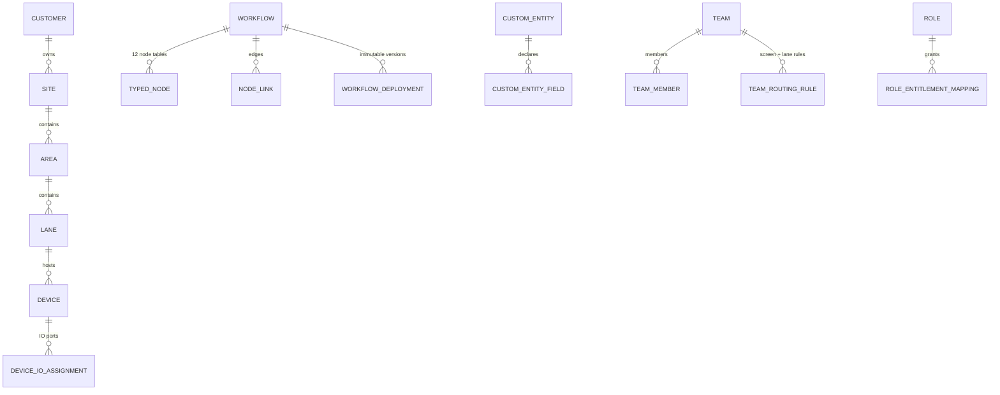

### What it persists

| View | Read by | Carries |
|---|---|---|
| `topology.customer` · `site` · `area` · `lane` · `lane_status` | runtime, edge, portal | The hierarchy: external ids, codes, `device_host_url`, `is_out_of_service`, `lane_priority`, `is_primary` |
| `topology.device` | runtime, edge | Device identity + type + capabilities per lane |
| `topology.screen` | runtime | Screen identity, joined with `manual_input` to carry the three SLA thresholds (below-expected / expected / max processing seconds) — populated only for work-item screens |
| `topology.team_routing` | runtime | Team ↔ screen+lane routing rules with priority |
| `topology.custom_entity` | runtime (query builder), core's publish-time validator | The declared custom-entity model — **the allow-list every selector is checked against** |

### Interface surface

*🔒 marks a contract fixed by the other side (§D2). Everything else is ours to design.*

| Method | Path | Summary | Consumer |
|---|---|---|---|
| GET · POST | `/customers` | List / create customers | ORCA Console |
| PATCH · DELETE | `/customers/{id}` | Update / retire a customer | ORCA Console |
| GET | `/sites` | List sites (tier- and role-scoped) | ORCA Console |
| POST | `/customers/{id}/sites` | Create a site (never primary — the installer creates the primary site) | ORCA Console |
| PATCH | `/sites/{id}` | Update site details, branding, localisation | ORCA Console |
| POST | `/sites/{id}/areas` · PATCH `/areas/{id}` | Create / update an area | ORCA Console |
| POST | `/areas/{id}/lanes` | Create a lane (licence lane-limit enforced → 403 at cap) | ORCA Console |
| PATCH | `/lanes/{id}` | Update lane incl. out-of-service toggle, queuing priority, device-host URL | ORCA Console |
| GET · POST | `/users` · PATCH `/users/{id}` | User management; exactly one role per user; site mappings | ORCA Console |
| GET · POST | `/roles` · PATCH `/roles/{id}` | Customer-defined roles; entitlement grants; site scoping | ORCA Console |
| GET | `/entitlements` | The catalog tree (application → module → sub-module → action item), licence-filtered | ORCA Console |
| GET | `/me/permissions` | Resolved entitlements for the calling token (menu/feature gating) | ORCA Console — *not* the Driver Portal, which is internet-facing and resolves its own permissions in orca-portal |
| GET · POST | `/lanes/{id}/devices` | Device inventory of a lane / register a device | ORCA Console |
| PATCH · DELETE | `/devices/{id}` | Update / retire a device (identity, connection, credentials, plugin-load params) | ORCA Console |
| PUT | `/devices/{id}/io-assignments` | Replace the IO port layout (input/output/relay/audio/tone; per-port flags) | ORCA Console |
| PUT | `/devices/{id}/perspectives` | Named PTZ presets | ORCA Console |
| PUT | `/resource-configurations/{scope}/{id}` | Custom variables at site/area/lane/device scope (read by selectors) | ORCA Console |
| GET · POST | `/workflows` | List processes, or create one in the ORCA builder | ORCA Console (builder) |
| GET | `/workflows/{id}` | Return the process. `?format=bpmn` returns the compiled definition the engine deploys; the default returns the authored source the builder opens | ORCA Console (builder) |
| PUT | `/workflows/{id}` | Save the model. Editing a published version clones it rather than mutating it | ORCA Console (builder) |
| POST | `/workflows/{id}/validate` | Publish-time validation: engine deployability, selector targets, unreachable branches, and a failure branch on every device-output step | ORCA Console (builder) |
| POST | `/workflows/{id}/publish` | Validate → freeze the version → store `definition_bpmn` + `source_json` immutably | ORCA Console (builder) |
| GET | `/workflows/{id}/versions` | Published versions of a workflow | ORCA Console |
| POST | `/deployments` | Assign a published version to lanes / areas | ORCA Console |
| POST | `/deployments/{id}/activate` | Deploy: running-visit guard, demote the previous version, push to runtime | ORCA Console |
| GET · POST | `/screens` · PUT `/screens/{id}` | Screen catalog over the frozen **36**-component vocabulary (the values the builder emits). The three SLA thresholds apply to **work-item (manual-input) screens only** — they live on `manual_input`, not on every screen | ORCA Console (builder) |
| GET · POST | `/subflows` · PUT `/subflows/{id}` | Shared subflow catalog | ORCA Console (builder) |
| GET · POST | `/io-configs` · PUT `/io-configs/{id}` | The IO channel catalog, with copy-on-write versioning once a workflow references it | ORCA Console (builder) |
| POST | `/selectors/search` | Selector autocomplete/validation against the declared model | ORCA Console (builder) |
| GET · POST | `/custom-entities` | List / declare a reference list (declared model only — DDL follows) | ORCA Console |
| PATCH | `/custom-entities/{id}` | Evolve the declared schema — executed as a controlled, declared migration | ORCA Console |
| POST | `/custom-entities/{id}/import` | Excel/CSV bulk import | ORCA Console |
| PUT | `/custom-entities/{id}/ingestion` | FTP/SFTP scheduled-ingestion configuration | ORCA Console |
| POST | `/custom-entities/{id}/query` | Query-builder read (allow-listed identifiers, parameterized values) for console grids | ORCA Console |
| GET | `/custom-entities/{id}/drift` | Declared-vs-physical drift report (detected, never auto-applied) | ORCA Console, site operations |
| POST | `/licence` | Upload/install a licence file (primary site only) | ORCA Console |
| GET | `/licence` | Status, licensed modules, resource limits, expiry | ORCA Console |
| POST | `/licence/refresh` | Re-read/pull the licence without restart | ORCA Console ** |
| GET · POST | `/teams` · PATCH `/teams/{id}` | Teams: members, handling method (Push/Prompt), shift & break templates | ORCA Console |
| GET · PUT | `/teams/{id}/routing-rules` | Screen + lane eligibility rules (evaluated by runtime via `topology.team_routing`) | ORCA Console |
| GET · POST | `/shift-templates` · `/break-templates` | Shift and break template catalogs | ORCA Console |
| GET · PUT | `/me/workspace/grids` | Grid configuration + column preferences per user | ORCA Console |
| GET · POST · DELETE | `/me/workspace/filters` | Saved filters | ORCA Console |
| GET | `/settings` · PUT `/settings/{key}` | Platform settings, validated against a registry of known keys; history appended; secrets rejected | ORCA Console |
| GET | `/internal/feed/v1` | Core's outbox feed by `publish_seq` cursor | orca-sync |
| POST | `/internal/apply/v1` | Owner-side apply for replicated core-owned entities (incl. declared custom-entity migrations) | orca-sync |
| GET | `/internal/topology/v1/{view}` | Topology pull for sites with no local database | orca-edge (thin edge) |
| GET | `/actuator/health` | Liveness and readiness | Orchestrator |

### When it fails

**The gate keeps running.** Runtime and edge read configuration through views in their own transactions, so core being down does not stop a visit in progress or a plate read arriving. What stops is *changing* things: no new design can be published, no device can be registered, no user can be created.

The exception is licence verification. A service that cannot establish its entitlement does not serve.

---

## C2 · orca-runtime — the gate brain

| | |
|---|---|
| **Owns** | The process engine, visits, work items, connectors, the partner event API, notifications, operator grids, lane commands |
| **Schema** | `runtime` — 22 tables including its outbox pair, plus the engine's own tables in the same schema |
| **Profiles** | Site appliance ✅ · Hosted tier ✅ · Thin edge — not deployed; a thin-edge lane is driven by a hosted runtime |
| **Why separate** | **Transaction cohesion.** These things commit together. Splitting them would put a network hop inside a transaction that must not have one |

### The concentration, and why it is safe

This is the largest service, and that is a deliberate choice rather than an accident. A visit advancing a step, a work item being created, and a connector call being recorded are one transaction. Splitting them across services would mean either distributed transactions or accepting that the three can disagree — and at a gate, they must not.

The risk is managed structurally rather than by intention: **module walls enforced at build time**, and bulkheads and circuit breakers so that a slow customer system cannot exhaust the resources the gate loop needs.

### Modules

| Module | In plain words | Owns |
|---|---|---|
| `execution` | The thing that actually runs a truck's visit, step by step | Executions, visits, node executions, payload storage |
| `workitem` | The queue of human work, and the rules for who gets each item | Work items and their audit trail |
| `integration` | The two-way door to customer systems | Connector configuration, event dispatch, the partner API |
| `notify` | Getting live information to people | Notifications, the WebSocket hub, push |
| `readmodel` | Pre-built views for the operator grids, so a grid never fans out across modules | Projections only |

**One deliberate exception.** The lane monitor grid legitimately needs running visits *beside* queued work items — two modules' data. Rather than let one module read another's tables, `readmodel` maintains a projection built from both. The rule holds; the grid is served from a view built for it.

**The integration seam.** `integration` reaches `execution` only through admission events in and connector invocations out. That narrowness is what makes the partner-facing surface replaceable without touching the engine.

### The engine

Flowable is embedded in the process, executing BPMN 2.0. It is not a separate service, there is nothing extra to install at a site, and it is reached behind an interface so the platform is not written against a specific engine's API throughout.

**Engine state is engine state.** Business data lives in platform tables keyed by the execution identifier; process variables carry correlation keys only. This keeps the engine's history tables bounded and keeps business payloads inside the platform's own retention model.

### Admission — the property the design turns on

Two device events for the same truck can arrive at the same instant, from two instances. **Exactly one visit must start.** Admission is therefore a single atomic correlate-or-start operation, not a read followed by a write, and every inbound path — camera, device host, partner API, portal — goes through the same one.

### Inside orca-runtime

#### Components

*Five modules in one process. Every arrow inside the box is an in-process call — no network hop and no independent failure.*

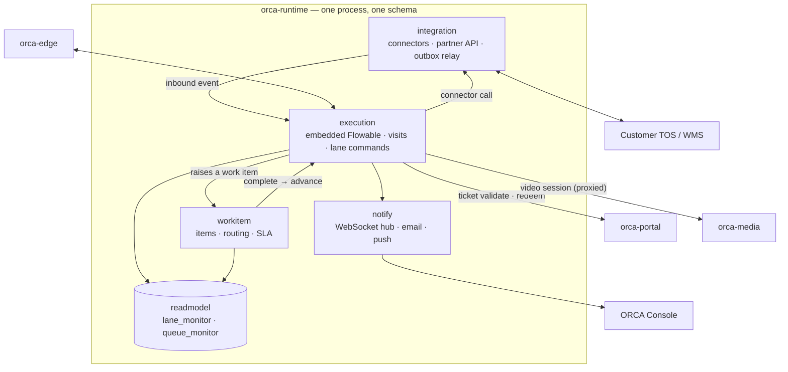

#### Data model

*How an execution relates to its steps, its captured data and the work it generates.*

```mermaid
erDiagram
 EXECUTION ||--o{ NODE_EXECUTION : "steps"
 EXECUTION ||--o{ DATA_SET : "captured data"
 EXECUTION ||--o{ PORTAL_SCAN_DATA : "scan reads"
 EXECUTION ||--o{ WORK_ITEM : "human work"
 EXECUTION ||--o| EXECUTION_CONTEXT : "operator-facing context"
 EXECUTION ||--o{ EXECUTION : "map-iterator children"
 WORK_ITEM ||--o{ WORK_ITEM_AUDIT : "trail"
 NODE_EXECUTION }o--o| PAYLOAD_BLOB : "payload_hash"
 DATA_SET }o--o| PAYLOAD_BLOB : "payload_hash"
 PORTAL_SCAN_DATA }o--o| PAYLOAD_BLOB : "payload_hash"
 EXECUTION_CONTEXT }o--o| PAYLOAD_BLOB : "payload_hash"
 CONNECTOR_CONFIG ||--o{ CONNECTOR_RESPONSE_CONFIG : "status routing"
 OUTBOX ||--o{ OUTBOX_DELIVERY : "per consumer"
 PAYLOAD_BLOB {
  bigint site_id "PK part 1 - dedup is per tenant"
  varchar content_hash "PK part 2 - SHA-256 of the body"
  bytea body "the ONLY place a large body is stored"
  varchar data_class "closed enumeration; drives retention"
 }
 NODE_EXECUTION {
  bigint site_id "RLS; also FK part 1"
  jsonb payload "inline only below the threshold"
  varchar payload_hash "NEW - FK part 2; NULL when the body is inline or absent"
 }
 DATA_SET {
  bigint site_id "RLS; also FK part 1"
  text value "inline only below the threshold"
  varchar payload_hash "NEW - FK part 2; NULL when the value is inline or absent"
 }
 PORTAL_SCAN_DATA {
  bigint site_id "RLS; also FK part 1"
  text value "inline only below the threshold"
  varchar payload_hash "NEW - FK part 2; never a copy of data_set.value"
 }
 EXECUTION_CONTEXT {
  bigint site_id "RLS; also FK part 1"
  jsonb context "inline only below the threshold"
  varchar payload_hash "NEW - FK part 2; NULL when the context is inline or absent"
 }
```

#### Work-item lifecycle

*The states a unit of human work moves through, and what causes each transition.*

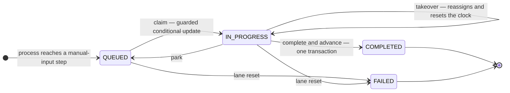

### What it persists

| Owner module | Tables | Purpose |
|---|---|---|
| `execution` | `execution` · `node_execution` · `execution_context` · `data_set` · `portal_scan_data` · `payload_blob` · `lane_session` · `retention_policy` | The visit and every step of it; captured data; the content-addressed payload store; the driver bound to a lane; per-client retention rules |
| `workitem` | `work_item` · `work_item_audit` · `user_status` · `user_activity` | Human work and its trail; operator presence |
| `integration` | `connector_config` · `connector_response_config` · `event_dispatch` · `event_type` · `outbox` · `outbox_delivery` · **`service_lease`** | Customer-system endpoints and response routing; the inbound dispatch queue; the transactional outbox and per-consumer acknowledgement; the fenced coordination lease |
| `notify` | `notification` | Operator notifications |
| `readmodel` | `lane_monitor` · `queue_monitor` | Grid projections, rebuilt from events — not a system of record |
| Property | What it is |
|---|---|
| Natural key | `(service, lease_name)` — unique, permanent per key, updated in place. Per-client, per-site-pair and per-lane scope **rides in `lease_name`**, which is how one mechanism covers a retention job, a feed reader and a per-lane election alike |
| What it holds | `holder_id` (the instance identity), `fence_token`, `acquired_at`, `renewed_at`, `expires_at` |
| How it is taken | A **conditional UPDATE guarded by rows-affected** — the same primitive as the work-item claim, so `RowsAffected = 0` means *you do not hold it*. `fence_token` **increments on every acquisition** and is verified **inside** the claim statement, never in a preceding check |
| Whose clock decides | **The database's, never a holder's.** Every expiry comparison happens server-side inside the guarded UPDATE, so two hosts with disagreeing clocks cannot disagree about who holds the lease |
| What it deliberately lacks | **No `site_id` and no row-level-security policy** (this is process-coordination state, not tenant data — every holder runs under the system context); **no audit quartet** (`holder_id` with the three timestamps *is* the record); **no soft delete** (a lease is released by expiry or by the next acquisition with a higher token — a `deleted_at` would be a second way to get check-then-act wrong on the one table whose purpose is to make check-then-act impossible); no `external_id`; not partitioned; not a retention class |
| Where it lives | **One per service schema, in the owning service's own schema** — `core`, `runtime`, `edge`, `portal`, `sync` and `fleet` — because a service can reach only its own schema by credential, so a single shared lease table would not be writable by the services that must write it. `media` is excluded: it has no application schema |
| What is *not* stated | **No duration, renewal interval or clock-skew allowance.** They are profile configuration that must be set explicitly, and a service **refuses to start** when either is unset or when expiry ≤ the renewal interval. That startup validation is the specification; this document asserts no number |
| Column | Why it exists |
|---|---|
| `lane_id` | Admission correlates, locks and indexes on this. The existing model had only a denormalised `lane_code`, which is unique per site and would collide across tenants in the Cloud profile |
| `parent_execution_id` | `NULL` for a root visit, set for map-iterator children. **The admission backstop constrains root visits only** — a naive unique index on the lane would reject every iterator child and break those workflows at runtime |
| `sequence_counter` | Allocates the outbox `sequence` for this visit, so the concurrent branches created by non-joining fan-out serialise on the visit row instead of racing |
| Status | Who writes it | Notes |
|---|---|---|
| `QUEUED` | The engine on reaching a manual-input node; also park | Queue membership is `status` + `queued_at` + assignee — there is no separate queue table |
| `IN_PROGRESS` | A successful claim, or takeover | **Only the conditional UPDATE prevents a double claim.** Pre-checks exist for the interface but are racy and must never be the guard |
| `COMPLETED` | Completion, which also advances the flow | The only persisted SLA outcome, `completion_duration_sec`, is written here |
| `FAILED` | **Lane reset** — verified in source: the reset transaction fails the visit, its open nodes **and its work items together** | Refines a corpus statement: the *bulk-fail route* has no caller, but `FAILED` is reachable and live via lane reset. Raised for correction |
| `ESCALATE_TO_LANE` | **Nothing** | The claim guard accepts it, and grids filter on it, but no code sets it. Carried as a claimable state with no writer |
| `ESCALATE_TO_CUSTOMER` | **Nothing** | Declared as a status constant and **read by nothing and written by nothing** — not even a grid filter |
| `RE_QUEUED` | **Nothing** | The status the SLA requeue path would set. Declared, never written — which is the enum-level evidence that the requeue behaviour below does not exist |
| `CLOSE` · `TAKEOVER` | Declared | `TAKEOVER` is an *action* the platform performs while leaving the item in progress, rather than a resting state |
| `PARKED` | Reserved | Park currently returns an item to `QUEUED`; there is no distinct parked state today |
| # | Invariant | How it is held |
|---|---|---|
| 1 | **A payload body is stored once.** Above a stated size threshold the body is written to `payload_blob` and the row carries a `payload_hash` reference; below it the body may be inline. **A row never carries both** — and a row with no body at all carries neither | A check constraint per table (`NOT (payload_hash IS NOT NULL AND body IS NOT NULL)`), plus a CI assertion that no row above the threshold carries an inline body. **The threshold is ruling Q**; this document states no number |
| 2 | **No duplicated payloads.** A body already present under the same `(site_id, content_hash)` is not written again, and **no table stores a copy of another table's payload** | The blob write is an upsert by content hash, so a repeat costs a lookup and no bytes. A conformance test asserts that one visit's identical bodies yield one blob row. **The named existing instance — stated in the past tense, because it has already been remediated:** the executor used to write, into `portal_scan_data` itself, a second row keyed `key = 'row_data'` carrying the **whole scan payload again** — an ***intra*-table** duplicate of the rows beside it, not a copy of `data_set.value` as earlier revisions of this document said, and read by nothing. It was deleted on `feature/OCS-4` in July 2026 and `grep '"row_data"'` over the executor now returns nothing. **The invariant stays as a forward rule** — the defect is fixed, the rule is what stops the next one |
| 3 | **Connector request and response bodies are bounded by default** | The existing default is **unbounded** — `CONNECTOR_MAX_RESPONSE_BYTES` defaults to `0` = disabled, code-verified on `feature/OCS-4`. The target ships a real default: over-threshold bodies are stored by reference or truncated with the truncation recorded on the row, **never inline and never unbounded**. Bounding is a **behaviour change** under quality goal 3 — a workflow whose selector reads past the bound sees something different — so the default value and the truncation semantics are **Product's ruling, not an implementation default** (ruling Q) |
| 4 | **Every table that grows with traffic has a retention class, and `data_class` is a closed, enumerated list** | A free `varchar` lets a typo silently create a class no purge job serves, so the rows live forever. **retention-class list v1.8 has closed it:** `retention_policy.data_class` is narrowed from `varchar(100)` to **`varchar(50)`, matching `payload_blob.data_class`, with a `CHECK` over an 18-value closed list**; adding a value is a schema change, not a configuration change. A CI check fails on any traffic-growing table with no class — which is how `execution` and `execution_context` stopped being missed. |
| 5 | **A bytes-per-visit budget is asserted in CI** | One visit through a representative workflow writes no more than a stated number of bytes across **all** tables, measured on the integration suite. A regression fails the build instead of surfacing as a disk alert two years into a deployment. **The budget number is set by ruling Q from the measurement task, not asserted here** |

### Interface surface

*🔒 marks a contract fixed by the other side (§D2). Everything else is ours to design.*

| Method | Path | Summary | Consumer |
|---|---|---|---|
| GET | `/visits` | Search visits by lane, site, status, time window | ORCA Console |
| GET | `/visits/{id}` | One visit with its current position and outcome | ORCA Console |
| GET | `/visits/{id}/nodes` | The step-by-step timeline of a visit | ORCA Console |
| GET | `/visits/{id}/data` | Captured data sets for a visit | ORCA Console |
| GET | `/visits/{id}/payloads/{hash}` | Fetch a stored payload body by content hash | ORCA Console |
| POST | `/visits/{id}/abort` | Terminate a visit, releasing its lane | ORCA Console |
| GET | `/lanes/{id}/visit` | The visit currently running on a lane | ORCA Console, kiosk |
| POST | `/lanes/{id}/reset` | **Reset the lane in one transaction** — abort the visit, fail its open nodes **and its work items**, set the lane status | ORCA Console |
| POST | `/lanes/{id}/gate-arm` | Raise or lower the barrier manually | ORCA Console |
| POST | `/lanes/{id}/reset-loops` | Reset loop sensors | ORCA Console |
| POST | `/lanes/{id}/reset-devices` | Re-issue each port's initial IO state | ORCA Console |
| GET | `/lanes/{id}/device-state` | Live device state for a lane. On a site profile this is served from edge; on the hosted tier, from runtime's replica | ORCA Console |
| GET | `/lanes/{id}/screen` | What the kiosk at this lane should currently display | Kiosk display |
| POST | `/screens/submit` | **Submit a rendered screen** — the call that resumes a parked visit | ORCA Console, kiosk |
| GET | `/unmatched-events` | Inbound events that matched no waiting node — visible, never silently dropped | ORCA Console, site operations |
| GET | `/work-items` | The queue, filtered by team, lane, status | ORCA Console |
| GET | `/work-items/{id}` | One item with its captured and corrected data | ORCA Console |
| POST | `/work-items/{id}/take` | **Claim an item** — a guarded conditional update; the loser receives a typed conflict rather than a silent no-op | ORCA Console |
| POST | `/work-items/{id}/takeover` | A supervisor takes an item from another operator | ORCA Console |
| POST | `/work-items/{id}/park` | Return an in-progress item to the queue | ORCA Console |
| POST | `/work-items/{id}/assign` | Pre-assign to a chosen operator; the item stays queued | ORCA Console |
| POST | `/work-items/{id}/complete` | **Complete and advance the flow in one transaction** | ORCA Console |
| GET | `/work-items/{id}/audit` | The action trail for an item | ORCA Console |
| POST | `/lanes/{id}/take-next` | Take-by-lane: claim the oldest queued item on this lane's running visit | ORCA Console (lane monitors) |
| GET · PUT | `/me/presence` | The operator's own state — idle, working, do-not-disturb, break, offline | ORCA Console |
| GET | `/operators/idle` | Idle operators eligible for an item, for assignment | ORCA Console |
| GET | `/operators/activity` | Presence history and durations | ORCA Console |
| POST | `/grids/queue` | The work-item queue grid | ORCA Console |
| POST | `/grids/lane-monitors` | The lane-monitor board | ORCA Console |
| POST | `/grids/alerts` | Lane alerts | ORCA Console |
| POST | `/grids/completed-work` | Completed work over a window | ORCA Console |
| POST | `/grids/export` | Start a streamed export of any grid | ORCA Console |
| GET | `/exports/{id}` | Export job status and download | ORCA Console |
| 🔒 POST | `/submit` | Submit one partner event | Customer TOS/WMS |
| 🔒 POST | `/submit/bulk` | Submit a batch — returns **207** with a per-item result array, deliberately not the standard envelope | Customer TOS/WMS |
| 🔒 POST | `/callback` | An external system answers a waiting workflow | Customer TOS/WMS |
| 🔒 GET | `/latest` · `/list` | Query submitted events; `list` supports paging and sorting | Customer TOS/WMS |
| 🔒 GET | `/next` | **Atomically claim** the highest-priority pending event — for partners that pull rather than receive | Customer TOS/WMS |
| 🔒 GET · PATCH | `/{uuid}` · `/{uuid}/status` | Inspect an event; report completion or failure | Customer TOS/WMS |
| 🔒 POST | `/{uuid}/replay` | Replay an event, optionally overriding its data | Customer TOS/WMS |
| GET · POST | `/connectors` · PATCH `/connectors/{id}` | **Connector configuration lives here, not in core** : endpoint, auth mode, certificate trust | ORCA Console (builder) |
| GET · PUT | `/connectors/{id}/response-routing` | Which status code takes which branch, including the catch-all | ORCA Console (builder) |
| POST | `/connectors/{id}/test` | Invoke a connector with sample data, without a visit | ORCA Console (builder) |
| GET | `/connectors/{id}/health` | Circuit-breaker state and recent outcomes | ORCA Console, site operations |
| GET · POST | `/event-types` · PATCH `/event-types/{id}` | The registry of event codes the gate accepts | ORCA Console (admin) |
| GET | `/event-dispatch` | The inbound dispatch queue and its claim state | Site operations |
| POST | `/event-dispatch/{id}/retry` | Retry a failed dispatch | Site operations |
| GET | `/outbox/parked` · POST `/outbox/{id}/retry` | Parked outbox events and their admin retry | Site operations |
| GET | `/notifications` · POST `/notifications/{id}/read` | Operator notification list and read state | ORCA Console |
| POST | `/notifications/ws-ticket` | A short-lived ticket used to open the WebSocket | ORCA Console |
| POST | `/internal/events/v1` | Accept a batch of device events; deduplicated by event id | orca-edge |
| POST | `/internal/deployments/v1` | Receive a published deployment; idempotent by deployment id | orca-core |
| GET | `/internal/feed/v1` | Runtime's outbox feed by `publish_seq` cursor | orca-sync |
| POST | `/internal/apply/v1` | Owner-side apply for runtime-owned entities | orca-sync |
| GET | `/actuator/health` | Liveness and readiness | Orchestrator |

### When it fails

| Failure | Effect |
|---|---|
| Runtime is down | Visits do not advance. Edge continues to accept and buffer captures, so nothing is lost; the queue at the gate grows |
| A customer system is slow | The circuit breaker opens for that connector. Other lanes and other connectors are unaffected |
| An instance dies mid-visit | Another instance picks the work up from the database. The visit continues from the step it had reached |

---

## C3 · orca-edge — the hardware boundary

| | |
|---|---|
| **Owns** | Every hardware contract, the durable capture buffer, the command log, device state |
| **Schema** | `edge` — 5 tables plus its outbox pair. On a thin edge, the same logical schema on a local embedded database |
| **Profiles** | Site appliance ✅ · Hosted tier — never, there is no hardware to face in a data centre · Thin edge ✅ — the only mandatory service |
| **Why separate** | **Placement and contract isolation.** It is the only thing a thin-edge site needs, and it puts all hardware risk in one deployable that can be tested against real equipment |

### What it does

Edge is where the platform meets equipment it does not control. It speaks the camera's protocol as the camera's firmware defines it, and the device host's REST contract in both directions — captures and IO transitions inbound, gate, print and IO commands outbound.

It holds **device state** — what each device is and what it was last known to be doing — and it buffers.

### Buffering, and the one thing it deliberately does not buffer

**Inbound captures are buffered durably, per lane, in order.** If runtime cannot take them — a restart, an upgrade, a network fault — nothing is lost, and they are delivered in order when it returns.

**Outbound commands are not buffered.** A command carries an expiry, and a command past its expiry is discarded rather than delivered. This is deliberate and worth stating plainly: **stale actuation is dangerous.** A barrier command issued for a truck that left ten minutes ago must not be delivered to a barrier now.

### Commands are confirmed, not assumed

A command completes when the device host confirms it acted — an acknowledgement *and* a body that decodes. Anything else is an unknown outcome, and an unknown outcome is followed by verifying the device's actual state rather than by assuming success or retrying blindly.

### One instance owns a lane

Cameras and device hosts each address a single endpoint. So while everything else runs on every instance, **device ingestion for a given lane is owned by one instance at a time**, established through a lease held in the database with a fencing token. If the owner stops, the lease expires and another instance takes the lane.

This is the one place the platform is not symmetric, and the reason is the hardware contract rather than a limitation of the design.

### Inside orca-edge

#### Components

*The hardware-facing modules, and the buffer that sits between capture and delivery.*

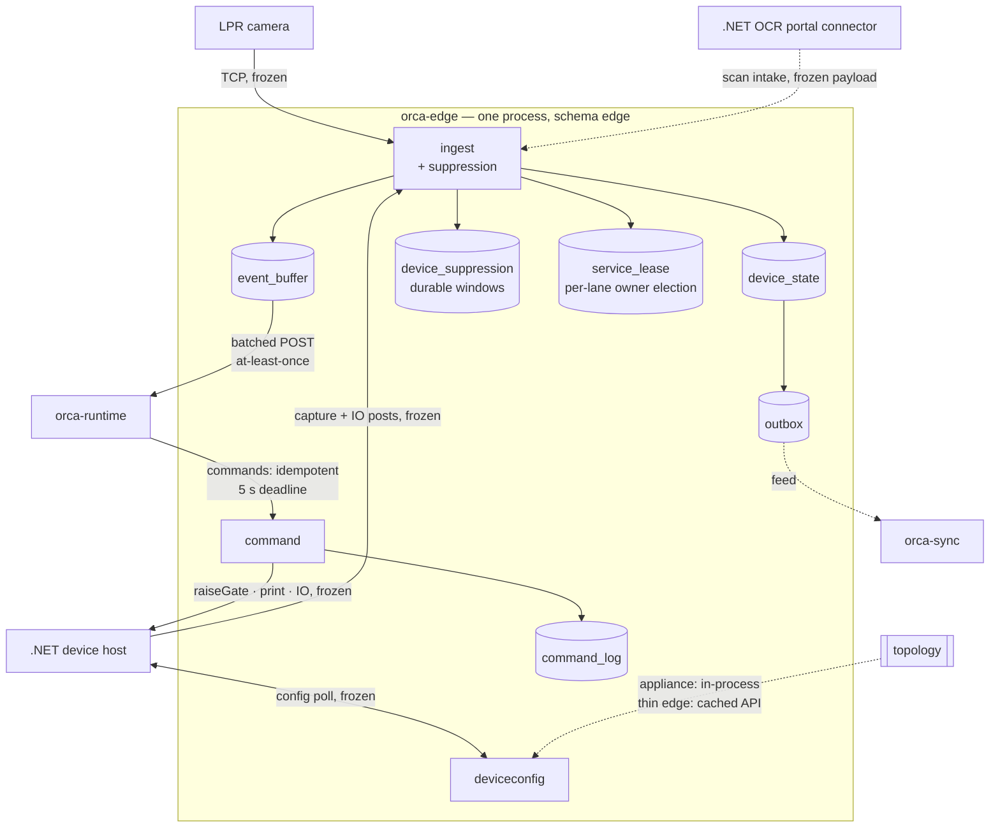

#### Command lifecycle

*A device command's states. `UNKNOWN` is the one that matters — it means the physical outcome is not known, and it is resolved by verifying the device rather than by retrying.*

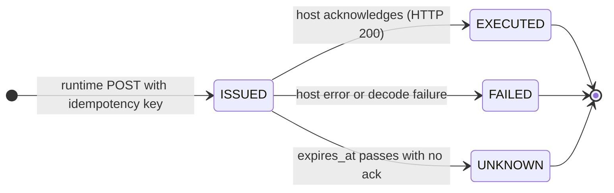

### What it persists

| Table | Owner module | Purpose | Notes |
|---|---|---|---|
| `device_state` | ingest | Latest known state per device (door open, sensor level, heartbeat) | Replicated upward as `device.state_changed` facts via the outbox |
| `device_suppression` | ingest | **Durable suppression windows**, keyed exactly as the frozen contract keys them: `{device_uuid}:data` and `{device_uuid}:io:{io_port}` | `opened_at` + `expires_at` (= `opened_at` + `wait_time_ms`) **evaluated against the database's clock, never an instance's**. Not partitioned; **no soft delete — a window closes by expiry, and a `deleted_at` would be a second, silent way for an open window to look closed**; no audit quartet; retention class `device_suppression`, and **only *expired* rows are ever purged**. Because the window is a row rather than process memory, **it survives an ownership handover** — the successor suppresses what its predecessor would have |
| `event_buffer` | buffer | Undelivered inbound events: `event_uuid` (dedup key), payload, `PENDING / DISPATCHED / ACKED / DEAD`, attempts | Per-lane FIFO with a monotonic sequence; bounded |
| `command_log` | command | Issued commands: idempotency key = the step's identifier, parameters, expiry, outcome (`ISSUED · EXECUTED · FAILED · UNKNOWN`), device response | A replay returns the recorded outcome and the host's acknowledgement, never a bare duplicate. Its retention floor is the longest engine job-lock expiry in the profile — a physical-safety floor |
| `service_lease` | ingest | The fenced coordination lease | Edge's is the one with the most visible consequence: **`lease_name = 'edge.ingest:lane:<lane_id>'` is the per-lane ingestion-owner election**. The owner binds that lane's LPR listener, answers that lane's configuration poll and capture posts, and writes that lane's `device_state` and `device_suppression` rows; a non-owner serves nothing device-facing for that lane. **Per lane rather than per site**, because the frozen contracts are per lane and one stuck owner must not idle a site |
| Profile | Storage | Sizing |
|---|---|---|
| Site Appliance | Tables in the site database | Buffer holds **≥72 h of peak traffic** at the licensed lane count |
| Thin Edge | SQLite in WAL mode; topology cached from core's API with a TTL and a **persisted last-known-good copy** | Same bound; there is no local database engine on a thin edge |

### Interface surface

*🔒 marks a contract fixed by the other side (§D2). Everything else is ours to design.*

| Method | Path | Summary | Consumer |
|---|---|---|---|
| 🔒 POST | `/device/{device_uuid}/data` | Accept a device capture payload `{data: [{key, value}]}` | .NET device host |
| 🔒 POST | `/device/{device_uuid}/io-state` | Accept an IO port transition `{io_port, io_port_name, status}` | .NET device host |
| 🔒 GET | `/configurations/{area_uuid}/{lane_uuid}` | Device inventory and plugin-load parameters for a lane. Credentials are returned in the clear — a property of the frozen contract, mitigated per §D2 | .NET device host |
| POST | `/internal/commands/v1` | Issue a device command: `command_id` (= node-execution id, the idempotency key), lane + device external ids, action (`RAISE_GATE · LOWER_GATE · PRINT · SET_IO · PTZ_PRESET`), `params`, `deadline_ms`. Responds `{status: EXECUTED \| FAILED \| UNKNOWN \| IN_PROGRESS, device_response, acked_at}` — **`UNKNOWN` is part of the enum, not an omission**: it is what the deadline produces and what drives the verify-gate-state branch, and a client that does not handle it will coerce it to `FAILED`, which is the exact hazard this design exists to prevent | orca-runtime |
| GET | `/internal/commands/{commandId}` | The recorded outcome and device response of a command | orca-runtime |
| GET | `/internal/device-state` | Current device state for a lane | orca-runtime |
| GET | `/internal/feed/v1` | Edge's outbox feed by cursor (`device.state_changed`) | orca-sync |
| GET | `/internal/buffer/stats` | Buffer depth, oldest event age, per lane | Site operations (diagnostics/alerting) |
| GET | `/actuator/health` | Liveness and readiness | Orchestrator |

### When it fails

| Failure | Effect |
|---|---|
| Edge is down | Nothing reaches the gate loop and the lane stops. This is the service whose availability the lane depends on |
| The link to runtime drops | Captures buffer locally, in order, and drain when it returns |
| A device host does not answer | The command's outcome is unknown; the device's state is verified rather than assumed |

---

## C4 · orca-portal — carriers and drivers

| | |
|---|---|
| **Owns** | Carriers, carrier users, drivers, tickets and their QR codes, appointments |
| **Schema** | `portal` — 12 tables plus its outbox pair |
| **Profiles** | Hosted tier ✅ authoritative · Site appliance — read replica only · Thin edge — not deployed |
| **Why separate** | **Security zone, and a different tenancy model** |

### Why it is its own service

Two reasons, both about isolation rather than size.

**It is the only service reachable from the public internet.** Drivers reach it from consumer networks on consumer devices. Keeping that surface in its own deployable, with its own credentials and its own schema, means a compromise there does not start inside the gate.

**Its tenancy model is genuinely different.** A haulage carrier delivers to terminals owned by different companies, and a driver should not hold one account per terminal they visit. So carrier and driver records are **cross-customer by design**, and are authoritative in the hosted tier — a single-customer appliance database cannot represent them.

That difference is why the portal's authorization is per-principal rather than per-tenant: a driver sees their own bookings across every terminal they visit, and nobody else's.

### What it persists

**Schema `portal` — 12 tables plus its outbox pair.** Column detail is defined by the service's own migrations.

| Table | Holds | Note |
|---|---|---|
| `carrier` | The haulage company | **Cross-customer** — a carrier delivers to terminals owned by different companies |
| `carrier_user` | Staff of a carrier | Cross-customer |
| `carrier_customer_site_mapping` | Which carriers a site accepts | The join that scopes a carrier to a site, without scoping the carrier itself |
| `driver` | The person at the wheel | Cross-customer; carries personal data |
| `driver_carrier_mapping` | Which carriers a driver drives for | A driver may drive for more than one |
| `ticket` | The driver-facing artifact of a visit, and its QR payload | Replicated to a site so a ticket can be validated when the link is down |
| `user_account` · `user_authentication_method` | Portal identity | Cross-customer |
| `push_notification_config` | Web-push subscriptions per device | Bound to the keypair identifying the platform to browser push services |
| `saved_user_filter` · `user_grid_preference` | Per-user interface state | Convenience data, not a system of record |
| `service_lease` | The fenced coordination lease | Per service, in the owning service's own schema |

**Nine of these carry neither a site nor a customer column, by design.** A carrier that hauls for three terminals is one carrier, not three, and a driver holds one account rather than one per gate they visit. That is why the portal's authorization is per-principal rather than per-tenant (§B6), and why these entities are authoritative in the hosted tier — a single-customer appliance database cannot represent them.

### Tickets and QR codes

A ticket is the driver-facing artifact of a visit, and its QR payload is an identifier the gate can resolve. **A site holds a replica sufficient to validate a ticket offline**, so a driver arriving during a link outage is not turned away.

### Inside orca-portal

#### Components

*The internet-facing service and what it exposes to whom.*

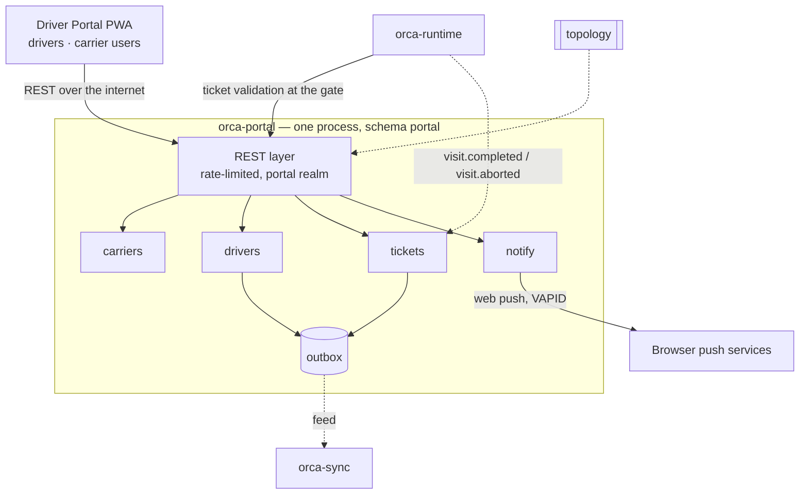

#### Data model

*Carriers, their staff and drivers — the entities that legitimately span customers.*

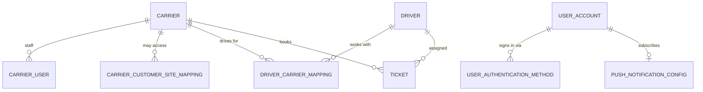

### Interface surface

*🔒 marks a contract fixed by the other side (§D2). Everything else is ours to design.*

| Method | Path | Summary | Consumer |
|---|---|---|---|
| GET · POST | `/carriers` · PATCH `/carriers/{id}` | Carrier companies | ORCA Console (admin) |
| GET · PUT | `/carriers/{id}/site-access` | Which customers and sites this carrier may work with | ORCA Console (admin) |
| GET · POST | `/carriers/{id}/users` · PATCH `/carrier-users/{id}` | Carrier staff accounts | Driver Portal (carrier admin), ORCA Console |
| GET · POST · DELETE | `/carriers/{id}/drivers` | Associate drivers with a carrier | Driver Portal (carrier admin) |
| GET · POST | `/drivers` · PATCH `/drivers/{id}` | Driver records, including licence and plate details | Driver Portal (carrier admin), ORCA Console |
| GET | `/me` | The signed-in driver or carrier user's own profile | Driver Portal |
| PUT | `/me/authentication-methods` | Link or unlink a sign-in method (social or password) | Driver Portal |
| POST | `/me/acceptances` | Record privacy-policy and terms acceptance | Driver Portal |
| GET | `/tickets` | List tickets, filtered by carrier, site, status or date | Driver Portal, ORCA Console |
| POST | `/tickets` | Create a pre-announcement, including the appointment and the pass-through columns | Driver Portal (carrier) |
| 🔒 GET | `/tickets/{id}` | One ticket, including its **QR payload — which is the ticket's external id, byte-identical to today's value** | Driver Portal |
| PATCH | `/tickets/{id}` | Amend a ticket while it is still `DRAFT` or `READY` | Driver Portal (carrier) |
| POST | `/tickets/{id}/assign-driver` | Assign or reassign the driver | Driver Portal (carrier) |
| POST | `/tickets/{id}/cancel` | Withdraw a ticket | Driver Portal (carrier) |
| GET | `/tickets/{id}/status` | Poll ticket progress — used by the driver's phone at the gate | Driver Portal |
| 🔒 PUT · DELETE | `/me/push-subscription` | Register or remove a web-push subscription — bound to the **preserved VAPID keypair**, which must not rotate | Driver Portal |
| GET | `/me/notifications` | The driver's message history | Driver Portal |
| POST | `/internal/tickets/validate` | **Validate a scanned QR at the gate** and return the ticket, its appointment and its driver. The gate is the caller because the scan happens there | orca-runtime |
| POST | `/internal/tickets/{id}/redeem` | Mark a ticket in progress against a visit | orca-runtime |
| GET | `/internal/feed/v1` | Portal's outbox feed by `publish_seq` cursor | orca-sync |
| POST | `/internal/apply/v1` | Owner-side apply for portal-owned entities | orca-sync |
| GET | `/actuator/health` | Liveness and readiness | Orchestrator |

### When it fails

| Failure | Effect |
|---|---|
| Portal is down | Drivers cannot pre-announce or retrieve tickets. The gate continues — a truck arriving without a pre-announcement is handled as an unannounced visit |
| The link between site and hosted tier drops | The site validates tickets against its replica, so a driver arriving during an outage is not turned away |

---

## C5 · orca-sync — replication

| | |
|---|---|
| **Owns** | Replication between a site and a hosted tier: cursors, acknowledgements, idempotency records |
| **Schema** | `sync` — 10 tables |
| **Profiles** | Site appliance — only when a tier is paired · Hosted tier ✅ · Thin edge — embedded inside orca-edge rather than run as a process |
| **Why separate** | **Existence condition.** It only exists where two tiers are paired, so it is a library first and a process only when a pairing is contracted |

### What it does

Sync carries **facts**, not commands. Each owning service writes a fact and its outbox row in one transaction; sync reads the outbox, delivers to the peer tier, and records the acknowledgement. Delivery is at-least-once and ordered per key, so a consumer must be idempotent — and idempotency is enforced by a recorded key rather than assumed.

**It is not a general message bus.** Sync knows which facts cross a tier boundary and in which direction. A service cannot ask it to carry something arbitrary.

### Inside orca-sync

*How a fact crosses a tier boundary: read from the owner's outbox, delivered in order, applied by the owner on the far side.*

```mermaid
flowchart LR
 subgraph SITE["Site tier"]
  OWN1["core · runtime<br/>portal · edge"] -->|"outbox rows"| FEED1["feed endpoints"]
  SS["orca-sync (site)"]
 end
 subgraph CLOUD["Cloud tier"]
  SC["orca-sync (cloud)"]
  OWN2["owning services"]
 end
 FEED1 -->|"GET feed by cursor"| SS
 SS -->|"batch: authenticated, compressed, ordered per key"| SC
 SC -->|"POST to the OWNER's apply endpoint"| OWN2
 OWN2 -->|"applied · duplicate · stale · unresolvable"| SC
 SC -->|"per-record outcome"| SS
```

### What it persists

| Group | Tables | Purpose |
|---|---|---|
| Ledger | `transaction` · `tracker` · `outbound_mapping` · `inbound_mapping` | One row per record change, grouped into runs, with their outcomes |
| Configuration | `service_configuration` · `module_configuration` · `alert_settings` · `mobile_centric_configuration` | Which tiers pair, what replicates, and when to warn |
| Files | `shared_file_tracker` | Files that must follow the records referencing them |
| Coordination | `service_lease` | The feed reader / cursor advance **per site pair**, and the idempotency-record TTL purge. **Note — Two cursors on one pair is how a replication gap becomes permanent** — this is the one lease outside `runtime` with a silent failure mode |
| Outcome | Code | Meaning | What sync does |
|---|---|---|---|
| Applied | `200 applied` | Written in the owner's transaction | Advance |
| Duplicate | `200 duplicate` | Already applied — the idempotency key matched | Advance; this is the normal replay case |
| Stale | `409 stale` | The local row is newer by sequence | **Record it and advance** — never retry blindly. A conflict response absorbs replay and ordering; it never adjudicates a genuine write conflict, because single-writer ownership means none can exist |
| Unresolvable | `422 unresolvable` | A reference could not be resolved | **Park the whole dependency group** and raise an alarm. Other groups keep flowing |

### Interface surface

*🔒 marks a contract fixed by the other side (§D2). Everything else is ours to design.*

| Method | Path | Summary | Consumer |
|---|---|---|---|
| GET | `/internal/status` | Per-entity-class replication position, lag and backlog depth | Site operations, ORCA Console |
| GET | `/internal/parked` | Records parked as unresolvable, with the reason | Site operations |
| POST | `/internal/parked/{id}/retry` | Retry one parked record after a human fixes the cause | Site operations |
| GET · PUT | `/internal/pairing` | The site-pair configuration and its channel credentials (write-only) | ORCA Console (admin) |
| PUT | `/internal/modules` | Which entity classes replicate, and on what schedule | ORCA Console (admin) |
| POST | `/internal/pairing/test` | Verify connectivity and authentication to the peer tier | ORCA Console (admin) |
| GET · PUT | `/internal/alerts` | Warning and escalation thresholds for a site falling behind | ORCA Console (admin) |
| POST | `/internal/batches` | Receive a batch from a peer tier and fan it out to owners | orca-sync (peer tier) |
| GET | `/actuator/health` | Liveness and readiness | Orchestrator |

### When it fails

| Failure | Effect |
|---|---|
| Sync is down | Facts accumulate in each service's outbox. Nothing is lost; the peer tier goes stale |
| The backlog grows beyond its bound | Retention cannot delete data a peer has not acknowledged, so the floor on retention is the backlog bound. This is what keeps an outage from silently destroying unreplicated data |

---

## C6 · orca-fleet — licences and releases

| | |
|---|---|
| **Owns** | Licence issuance and signing, the fleet registry, release artifact distribution |
| **Schema** | `fleet` — 4 tables |
| **Profiles** | Hosted tier ✅ **Lynxis operations only** · Never at a customer site |
| **Why separate** | **Security by structure.** Signing keys cannot ship on a customer's box |

### What it does

Fleet issues the signed licence that an installation verifies at startup. It holds the signing keys, the issuance ledger — every licence ever issued, to which site, expiring when, signed with which key — and the registry of installations with their installed version, target version and last heartbeat.

**The signing half never leaves the cloud.** Only the public verification half ships to a site. This is the reason fleet is a separate service rather than a module of core: the boundary is what keeps the private key off customer hardware.

**Sites pull; fleet does not push.** An installation reports its heartbeat and pulls what it is entitled to. Nothing in the cloud initiates a connection into a customer's network.

**The registry is also where duplication becomes visible.** Each heartbeat carries the reporting machine's identity as telemetry. Enforcement never depends on it — a licence is enforced at the site, by signature and instance count — but one licence reporting from two different identities is flagged in the fleet view, so a cloned installation is a detected fact and a commercial conversation rather than a silent loss. *(Ruled 8 Aug 2026 — register item 20.)*

### Inside orca-fleet

*The cloud-only service. The signing half never leaves this boundary.*

```mermaid
flowchart TB
 OPS["Lynxis operations"] -->|"issue · revoke · view fleet"| API
 subgraph FLEET["orca-fleet — cloud only, schema fleet"]
  API["REST layer"]
  API --> ISS["issuance<br/>sign with the private key"]
  API --> REG["registry"]
  API --> ART["artifacts"]
  ISS --> LK[("license_key<br/>private half — cloud only")]
  ISS --> IL[("issued_license")]
  REG --> SR[("site_registry")]
 end
 ISS -->|"signed licence file"| SITE["Site — orca-core verifies<br/>with the PUBLIC key only"]
 ART -->|"signed release artifacts"| SITE
 SITE -.->|"heartbeat: version, pairing state"| REG
```

### What it persists

| Table | Purpose | Notes |
|---|---|---|
| `license_key` | The signing keypair per site | The **private half is encrypted and key-versioned, and exists nowhere else**. Only the public half ships to a site, as `core.site_license_key` |
| `issued_license` | The issuance ledger | Every licence ever issued: to which site, when, expiring when, signed with which keypair, revoked when |
| `site_registry` | The fleet | Installed version, target version, pairing tier, last heartbeat |
| `service_lease` | The fenced coordination lease | Per service, in the owning service's own schema |

### Interface surface

*🔒 marks a contract fixed by the other side (§D2). Everything else is ours to design.*

| Method | Path | Summary | Consumer |
|---|---|---|---|
| GET · POST | `/licences` | List issued licences / issue and sign a new one | Lynxis operations |
| GET | `/licences/{id}` | One licence and its issuance record | Lynxis operations |
| POST | `/licences/{id}/revoke` | Revoke, recording the reason and time | Lynxis operations |
| GET | `/licences/{id}/download` | Download the signed licence file for delivery to a site | Lynxis operations |
| POST | `/sites/{id}/keys` | Generate a site's signing keypair | Lynxis operations |
| GET | `/sites/{id}/public-key` | The public half, which is what ships to the site | Lynxis operations, orca-core (installation) |
| GET · POST | `/sites` · PATCH `/sites/{id}` | The fleet registry: register a site, update its pairing tier | Lynxis operations |
| POST | `/internal/sites/{id}/heartbeat` | A site reports its installed version and health | orca-core, from its licensing module |
| GET · POST | `/artifacts` | List and publish signed release artifacts | Lynxis operations |
| GET | `/artifacts/{channel}/latest` | The current release for a rollout channel | orca-core (site upgrade) — same owner as the heartbeat above |
| GET | `/actuator/health` | Liveness and readiness | Orchestrator |

### When it fails

Nothing at a site stops. A site holds its licence locally and verifies against the local file. What stops is issuing new licences, registering new installations, and distributing releases.

---

## C7 · orca-media — video and intercom

| | |
|---|---|
| **Owns** | Video relay, streaming, intercom signalling |
| **Schema** | **None of its own.** The telephony engine reads its own configuration tables directly, in its own format |
| **Profiles** | Site appliance ✅ · Hosted tier — not deployed · Thin edge — optional |
| **Why separate** | **Blast radius, and it already works.** Real-time media is a specialism, and it holds no domain logic |

### What it does

Media relays camera streams to operator browsers and carries operator-to-driver audio at the lane. It is delivered in its existing technology rather than rebuilt: a working real-time relay is a poor thing to rewrite, and there is no domain logic inside it to modernise.

**Browsers do not call it directly.** Runtime proxies every request after authorising the operator, so the media path carries no authorisation decisions of its own and is not exposed to an operator's browser as an independent surface.

### Inside orca-media

*The media path. Browsers never call this service directly — runtime proxies every request after authorising the operator.*

```mermaid
flowchart LR
 CAM["Camera<br/>RTSP"] -->|"pull"| FF["stream-forwarder<br/>supervises FFmpeg"]
 FF -->|"RTP over UDP<br/>VP8, audio stripped"| WR["lynxis-webrtc<br/>pion relay"]
 WR -->|"WebRTC video"| BR["Browser player<br/>(rebuilt)"]
 RT["orca-runtime"] -->|"proxies signal · register · start · stop"| WR
 RT --> FF
 BR <-->|"SIP over WSS — bypasses the Go plane entirely"| AST["Asterisk"]
 AST -.->|"reads PJSIP config"| DB[("media schema<br/>ps_* tables")]
```

### Interface surface

*🔒 marks a contract fixed by the other side (§D2). Everything else is ours to design.*

| Method | Path | Summary | Consumer |
|---|---|---|---|
| POST | `/signal` | The signalling exchange: accepts the browser's offer, returns the answer **with all server candidates inline** | orca-runtime (proxying the console) |
| POST | `/register` | Reserve a UDP port for a stream key, open the RTP listener, then ask the forwarder to start | orca-runtime |
| GET | `/list_connections` | Active connections per stream key — used to decide whether a stream may be stopped | stream-forwarder-service |
| PUT | `/system-configs` | Update runtime-editable settings | ORCA Console (admin) |
| GET | `/webrtc/api/health` · `/webrtc/system/metrics` · `/webrtc/prometheus/metrics` | Health, database-pool metrics, Prometheus | Infrastructure, ops |
| POST | `/start_stream` | Spawn FFmpeg for a stream key; conflict if one is already running | lynxis-webrtc-service, orca-runtime |
| POST | `/stop_stream` | Stop it — **but only after checking `/list_connections`**; if any viewer remains, it declines and keeps streaming | lynxis-webrtc-service, orca-runtime |
| GET | `/is_stream_active` | Whether a stream key is running | orca-runtime |
| GET | `/list_streams` | All active stream keys | Ops. **No in-repo caller** |
| POST | `/refresh_config` | **Dead** — it reloads configuration and discards the result | **None — no caller exists.** Documented because it is on the inherited surface; a candidate for deletion |
| PUT | `/system-configs` | Update runtime-editable settings | ORCA Console (admin) |
| GET | `/streamforwarder/api/health` · `/system/metrics` · `/prometheus/metrics` | Health, database-pool metrics, Prometheus | Infrastructure, ops |

### What it persists

**Nothing of its own.** The service holds no application schema and no domain state — it is a relay, and a stream is not a record.

The telephony engine reads its own configuration tables directly, in its own format, over its own database connection. Those tables are the engine's, not the platform's: the platform does not read them, write them, or model them, and they carry no ORCA retention rule.

### When it fails

Video and intercom stop. **The gate is unaffected** — no process step depends on a stream, and a lane continues to run without an operator being able to see it.


---

# Part D · Reference

## D1 · Architecture decision records

Seventeen decisions shape everything above. Each is recorded with what it rejected, what it costs, and how it would be reversed — because a decision without a stated cost is an assertion, and one without a reversal path is a trap.

| # | Decision | Rejected | What it costs | How to reverse |
|---|---|---|---|---|
| **001** | Build on **Java 25 / Spring Boot 4** | Quarkus — deferred rather than rejected | A JVM footprint on an appliance | Contained: the framework is not in the domain model |
| **002** | **Seven services**, drawn on transactional boundaries | A finer domain split, which would turn consistency into network hops; a single deployable, which would lose thin-edge placement | One service (runtime) is large | Split runtime along its module walls, which exist for this |
| **003** | **SQL Server ships. PostgreSQL is deferred** — one entity model through JPA/Hibernate, behind one engine seam | Building both engines now; committing to a single engine forever | One seam to maintain with one implementation behind it | Build the second implementation when a deployment needs it |
| **004** | **Schema-per-service in one cluster**, enforced by per-service database credentials | A database per service — it forbids the in-transaction reads that keep the gate path fast | Coordination state is duplicated per schema | Merge schemas; the credentials are the only enforcement |
| **005** | **Scope is enforced in one place, applied by construction**, with a build-time check that fails when a query bypasses it | Per-query conditions — the mechanism that fails by omission | A seam every data path must go through | The requirement is the decision; the mechanism is owned by the security design |
| **006** | **Embedded Flowable executing BPMN 2.0**, with ORCA's builder compiling to BPMN at publish | A bespoke engine, which is what the rebuild exists to remove; a bpmn-js modeller, which would put a third-party watermark on the authoring surface | A permanent compiler and a conformance harness | The engine sits behind an interface; the compiler is the harder half to unwind |
| **007** | **No message broker inside a site** — a transactional outbox, claimed with a skip-locked read | Running a broker per site: a server to provision, patch and monitor for point-to-point delivery | Cross-consumer replay is bounded by retention rather than by a log | Introduce a broker behind the same outbox interface |
| **008** | **Device commands are synchronous, acknowledged and idempotent** — never queued | Queued commands: a replayed stale gate command is physically dangerous | A command has no delivery guarantee beyond its expiry | Not advisable; the reason is safety, not architecture |
| **009** | **Published read-only views** as the only cross-schema read | Core-as-an-API on the gate path, which adds a network hop to every world-model lookup; shared tables, which lose ownership | Core must maintain the views as a contract | Replace a view with an API where latency permits |
| **010** | **Single writer per entity class**; replication applies only through the owner | Log-based replication, which couples schemas across versions | A site cannot author what the tier owns | Grant a second writer, and accept reconciling conflicts |
| **011** | **Keycloak retained for USER authentication**; OpenID Connect for every caller acting for a person; **service-to-service calls carry a per-installation shared credential instead of a token**; no service mesh | Building identity; a mesh with mutual TLS between services — over-engineering for an appliance; OIDC service accounts for inter-service calls, which put token *issuing* on the gate path and stop it minutes into a wide-area outage | One credential to provision and rotate per installation, and a second authentication mechanism to understand alongside OIDC | Re-enable the service-account clients; the resource server already validates any bearer token, so the change is configuration rather than code |
| **012** | **orca-media delivered unchanged**, in its existing technology | Rewriting it on the JVM — possible, and it buys nothing | One non-JVM component in the estate | Rewrite it when there is a reason to |
| **013** | **The device boundary stays frozen** | Re-acquiring the driver layer — it would mean re-certifying every device vendor | The contract's constraints are inherited, including credentials returned in the clear on the configuration poll | Not without a vendor programme |
| **014** | **Monorepo, contract-first APIs**, expand-only compatibility across adjacent versions | Per-service repositories; code-first APIs | One version truth across seven services | Split the repository once the contracts are stable |
| **015** | **The platform is multi-instance by design.** Coordination is database-held; no instance assumes it is the only one | One instance per site, which cannot satisfy the availability requirement | Every coordination point needs a lease and a fence token | Reversal would mean re-introducing in-process state |
| **016** | **Rebuild the screen builder's authoring experience, and design the saved format for the target** — a schema version in the artifact from the first release, and one component registry every renderer imports | Freezing an inherited format, whose justification was compatibility with screens that will not exist | The format is new, so it has no field history to lean on | The format is versioned from the start, which is what makes it changeable |
| **017** | **Write-reduction before retention.** The system persists only what a named consumer reads; large bodies are stored once per distinct content and referenced | Retention alone, which bounds how long data is kept but not how much arrives | A reference to resolve on read, and a sweep for unreferenced bodies | Inline the bodies again; the reference is an indirection, not a model change |

**Five decisions changed after they were first taken**, and the reasons are worth keeping: **001** moved from Java 21 / Boot 3 to Java 25 / Boot 4 before the first line was written, both being long-term-support releases; **003** narrowed when the first deployment's engine was confirmed; **006** kept its engine half and reversed its authoring half when migration left the scope; **011** narrowed "OpenID Connect everywhere" to people only, when it became clear that inter-service token *issuing* put the identity provider on the gate path; **016** reversed its freeze when the artifacts it was compatible with ceased to exist. Each was re-signed rather than quietly reinterpreted.

## D2 · External contracts, in full

Four interfaces are fixed by what sits on the other side. These are reproduced exactly and proven by contract tests.

| Contract | Direction | Shape | Why it cannot move |
|---|---|---|---|
| **LPR camera protocol** | In | Framed XML over TCP, with acknowledgement back to the camera. Images referenced by filesystem path | The protocol belongs to the camera vendor and is burned into units already mounted at gates |
| **Device-host REST** | Both | Capture payloads and IO transitions inbound; gate, print and generic IO commands outbound; a configuration poll returning device inventory and plugin-load parameters | The device host is a field-proven vendor component. Changing this contract would mean re-certifying every device vendor |
| **OCR portal intake** | In | The scan payload, with images handed off by filesystem path | An external component whose image hand-off assumes a shared filesystem layout, tying the contract to deployment as well as to the wire |
| **Outbound connector semantics** | Out | REST and SOAP, four authentication modes, per-connector certificate trust | The other end is the customer's own system. The platform must support the shape; it does not choose it |

**Two properties of these contracts that must reach whoever implements them:**

**There is no mutual TLS.** The per-connector TLS option installs a trust store for verifying the *server* certificate — one-way. Where a customer requires mutual TLS, it is added work rather than configuration.

**The device-host configuration poll returns device credentials in the clear.** This is a property of the frozen contract, not a choice. It is mitigated by serving that endpoint only on the site-internal network, to the device service identity, and logging every call.

## D3 · Conventions

| Convention | Rule |
|---|---|
| **Identifiers** | Every entity carries an internal key and an external identifier. Interfaces use the external one; internal joins use the key. External identifiers are never reused |
| **Idempotency** | Every command and every applied fact carries a key. Applying the same key twice has the effect of applying it once, and that is enforced by a recorded key rather than assumed |
| **Ordering** | Facts are ordered per key, not globally. A consumer that needs global order is using the wrong mechanism |
| **Time** | The database clock is the reference for anything two instances must agree on. Instance clocks are not trusted for coordination |
| **Leases** | Anything only one instance may do at a time is held by a lease with an expiry and a fence token. A holder that has lost its lease cannot complete a write it began |
| **Compatibility** | A service interoperates with the previous version of its peers for the duration of an upgrade. Schema changes are expand-only across that pair |
| **Deletion** | Records are retired rather than removed, except where a retention policy deletes them deliberately. Retention never deletes data a registered consumer has not acknowledged |
| **Deadlines** | Every external call has a deadline and a defined outcome when it is exceeded. No call waits indefinitely |
| **Errors** | One response shape everywhere, with a machine-readable code a caller can branch on without reading the message. Internal detail, stack traces and schema are never returned to a caller |
| **System context** | Every entry point that runs without a user — a relay, a scheduled job, a reconciler — enters an explicit system context. No path runs with no identity |

## D4 · Points decided ad hoc

A point is marked **decided ad hoc** only when all three of the following hold:

1. **The design does not depend on the answer** — no other decision changes whichever way it goes.
2. **It is cheap to change** — settling it wrongly costs a local edit, not a migration or a re-release.
3. **Whoever implements that part can settle it at the time**, without needing this document amended.

Anything failing any of the three is not ad hoc. It is either stated as the design in Parts A–C, or it is an open question and it lives in the companion register.

**At this revision, no point in this document is marked decided ad hoc.** That is the intended outcome rather than an omission: the convention exists so that a genuinely trivial choice can be left open without pretending it is decided — not as a place to put things that were hard to answer.

## D5 · Glossary

| Term | Meaning |
|---|---|
| **Appliance** | A server at a customer facility running the platform. A site may run more than one |
| **Area · lane** | Subdivisions of a site. A lane is where a truck is processed and where devices live |
| **BPMN 2.0** | The international standard notation for business processes. The platform's execution representation |
| **Compensation** | Undoing steps that already completed, when a process fails part-way through |
| **Connector** | A configured call to a customer system — REST or SOAP, with its own authentication and certificate trust |
| **Device host** | The per-lane component that drives barriers, printers, kiosks and IO. External to the platform |
| **Fence token** | A number issued with a lease that increases each time the lease changes hands, so a holder that has lost its lease cannot complete a write |
| **Lease** | A time-bounded claim on something only one instance may do at a time, held in the database |
| **Outbox** | A table written in the same transaction as the fact it describes, so a fact cannot be published without being recorded |
| **Owner instance** | For device ingestion, the one instance currently holding a lane's lease |
| **Partner event API** | The interface a customer's own systems call to submit events and query their outcome |
| **Primary site** | The installation's own site. Exactly one per installation, and the one the licence binds to |
| **Profile** | A composition of the same images for one kind of installation. Says which services run, not how many instances |
| **RTO · RPO** | Recovery Time Objective — how long until service is back. Recovery Point Objective — how much data may be lost |
| **Site** | A customer facility with gates. A customer may operate several |
| **Skip-locked read** | A claim that takes the next available row and steps over rows another instance already holds, so instances do not contend |
| **Thin edge** | A deployment where only the hardware-facing service runs at the site |
| **Visit** | One truck's passage through a gate, from identification to release |
| **Work item** | A unit of human work created when automation cannot complete a step |

---

*ORCA — Platform Architecture · Revision A · August 2026. Companion: **ORCA — Open Questions and Clarifications**, which carries everything this document does not.*
