# ORCA 2.0 — system reference

**What the platform is, how it is put together, how it survives more than one instance,
and how it is hosted.**

A high-level reference for anyone — human or AI — who needs to understand this system
before working on it. §1–§8 are the system; §9 is the developer's detail.

> **Scope of this document.** It describes the architecture and the deployment model.
> It is not a status report: where a component is designed but not yet built, §8.9 says
> so plainly, because a reference that implies otherwise would mislead its reader.
>
> **It is the entry point, not the authority on everything.** Each topic has exactly one
> owning document, and **§10 routes you to it.** Where this document and a more specific
> one disagree, the specific one wins — and where either disagrees with the code, the
> code wins.

---

## 1 · What ORCA is, and the two properties everything comes from

ORCA is a gate-automation platform for logistics facilities — container terminals and
distribution centres. Cameras read truck plates, customer-designed processes orchestrate
devices and external systems, work that automation cannot finish is routed to a clerk,
and carriers pre-announce visits through a driver portal.

**Two properties shape every decision. Most of the architecture is a consequence of one
of them.**

**① The gate must keep working when other things do not.**
A truck at a barrier is a physical queue. If the platform stops, that queue grows into
the public road. This is why there is no message broker to fail, why every external call
has a deadline *and* a defined outcome when the deadline passes, why service-to-service
calls never need the identity provider, and why an unknown answer sends a truck to a
human rather than opening a barrier.

**② The site's processes belong to the site.**
Terminals do not run the same process. Processes and screens are designed by the
customer's own administrators, visually, without code. This is why a process carries a
connector's *name* and never its address, and why publishing a process takes an
immutable snapshot.

## 2 · Repository map

Twelve Gradle modules. The root holds no code.

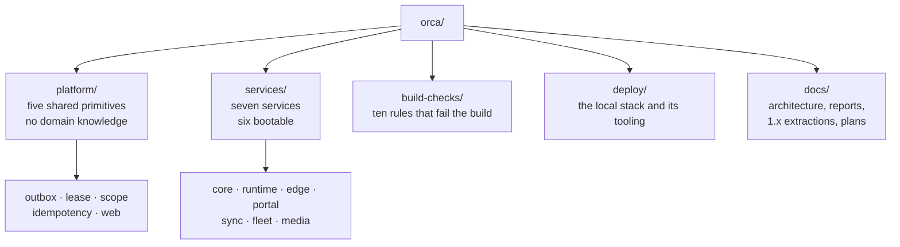

**`platform/` holds no domain types.** A build check forbids the words *visit, lane,
ticket, driver* and *truck* anywhere inside it. If a primitive needs to know about the
domain, the design is wrong somewhere else.

→ **`docs/REPOSITORY_GUIDE.md`** owns the folder-by-folder detail and how the build is
composed.

## 3 · The seven services

Each owns a slice of the world, and **each reaches only its own database schema** —
enforced by database credentials, not by convention.

| Service | Owns |
|---|---|
| **`orca-core`** | The world **as configured** — sites, lanes, users, devices, teams, settings |
| **`orca-runtime`** | The world **as it happens** — the engine, visits, work items, connectors |
| **`orca-edge`** | Every hardware contract, the capture buffer, the command log |
| **`orca-portal`** | Carriers, drivers, tickets — the only internet-facing service |
| **`orca-sync`** | Replication between a site and a hosted tier |
| **`orca-fleet`** | Licence issuance and signing |
| **`orca-media`** | Video and intercom |

**The distinction worth internalising: core is what somebody configured; runtime is what
actually happened.** A lane exists because an administrator created it — that is core. A
truck went through it at 14:32 — that is runtime.

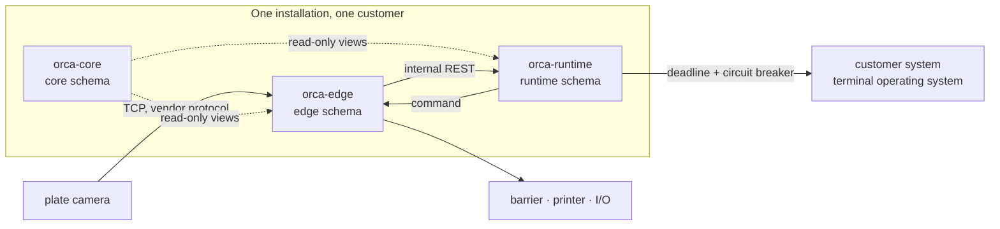

**Only five mechanisms are permitted between services**, each because a different
guarantee is needed:

| # | Mechanism | Guarantees | Cannot |
|---|---|---|---|
| 1 | In-process module events | Transactional with the publishing step | Cross a process boundary |
| 2 | Read-only views onto core's world model | Same-transaction consistency, no network hop | Be written to |
| 3 | Synchronous REST | A deadline, an idempotency key, a bounded retry | Survive the callee being down |
| 4 | Transactional outbox | At-least-once, ordered per key, acknowledged per consumer | Deliver instantly |
| 5 | WebSocket push | Best effort, and nothing more | Be relied upon — the query is authoritative on reconnect |

## 4 · The spine: one truck, end to end

This is the path the whole platform exists to run. It takes about a second.

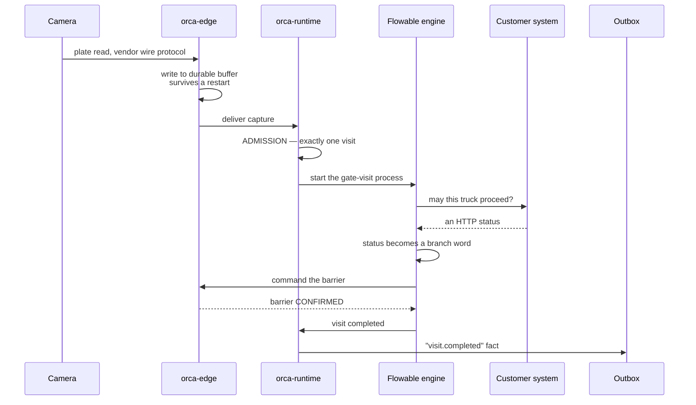

Three deliberate decisions in that picture:

- **The buffer is durable before anything else happens.** A capture that reached us is
  never lost to a restart.
- **The customer system's answer becomes a *word*, not a body.** `200` becomes
  `APPROVED`, `409` becomes `ALREADY_COLLECTED` — configured per site. **A status nobody
  mapped becomes `HTTP_503`, which no process has a branch for, so the truck goes to a
  human.** Intended behaviour, not a fallback: an answer nobody wrote a branch for must
  never become an implicit approval that opens a barrier.
- **The barrier is confirmed, not assumed.** A command whose outcome is unknown is never
  treated as done.

## 5 · The five primitives

Built once, before any service. The useful way to hold them is not "what does it do" but
**"what goes wrong without it."**

| Primitive | Reach for it when | What it prevents |
|---|---|---|
| **`outbox`** | Telling another service something happened | A fact recorded but never told, or told but never recorded. **The fact and its outbox row commit in one transaction — writing outside a transaction is refused** |
| **`lease`** | Only one instance may do this at a time | Two instances both believing they own a lane |
| **`scope`** | Reading or writing **any** table | A query escaping its site. **No scope set means zero rows, never all rows** |
| **`idempotency`** | A command that might be retried | A retry causing a second effect. A replay returns **the recorded outcome**, never "duplicate" |
| **`web`** | Returning anything over HTTP | Ad-hoc response shapes, leaked internals, background work running with no identity |

**The outbox, in one picture:**

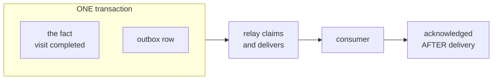

Both halves commit together or neither does, and acknowledgement happens after delivery
— the difference between at-least-once and quietly losing things.

**Idempotency is about the caller, not about us.** When a duplicate arrives the answer is
*the original outcome*, not an error — because the caller retried precisely because it
never saw the first answer. A rejection is the one response it cannot use.

→ **`docs/PLATFORM_PRIMITIVES.md`** covers each primitive in depth: what it is called in
the literature, what actually gets built, how a service wires it, and what is deliberately
*not* in `platform/`.

## 6 · Running more than one instance

**The platform is designed for more than one instance in every deployment profile.**
Everything in this section exists to make that safe.

### 6.1 · The rule underneath all of it

> **Never check, then act.**
> The decision is made *inside a single guarded SQL statement*, and the caller learns
> what happened from what that statement returned.

Reading a row, deciding in Java, then writing is the bug: between the read and the write,
the other instance does both. Pre-checks may exist for a nicer error message, but they
are never the guard.

**The database's clock decides anything two instances must agree on** — never a JVM
clock. Expiry comparisons live inside the statement.

### 6.2 · Lease with a fence token — "only one of us may do this"

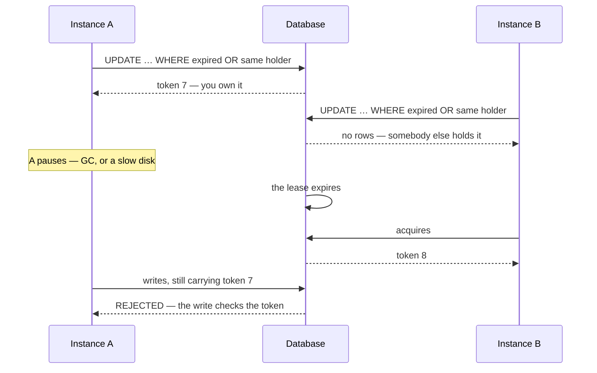

Three subtleties, all deliberate:

- **Renewal verifies the token inside the statement.** An instance that lost and regained
  a lease has a different token; renewing with the old one must not succeed.
- **Release expires the row — it never deletes it.** The row carries the token, and
  deleting it would let the next acquisition start from a *lower* number. A fence token
  must never go backwards.
- **Holding the lease is not permission to write.** The token goes into the write's own
  `WHERE` clause, which is what makes the last step above safe.

### 6.3 · Skip-locked claim — "we share a queue without colliding"

The outbox relay runs on every instance at once.

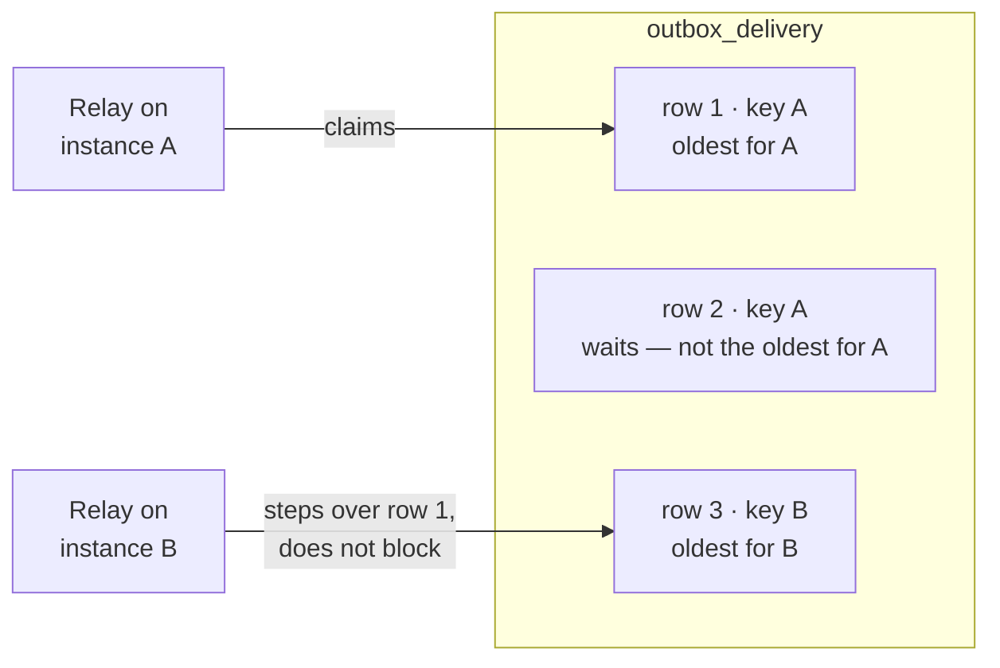

`READPAST` makes two relays **cooperative** rather than serialised — the second steps
over what the first holds instead of queueing behind it. `UPDLOCK` makes the claim
survive to commit.

⚠️ **Drop either and you get a lock convoy or a double delivery — and both look
completely fine in a single-instance test.**

**Ordering is per key, never global.** A row is claimable only when it is the oldest
unacknowledged row *for its ordering key*, so a stuck fact blocks its own key and nothing
else. One wedged consumer cannot stop the world.

### 6.4 · One truck, one visit

Two device events for the same truck can arrive at two instances at the same instant.
Exactly one visit must result.

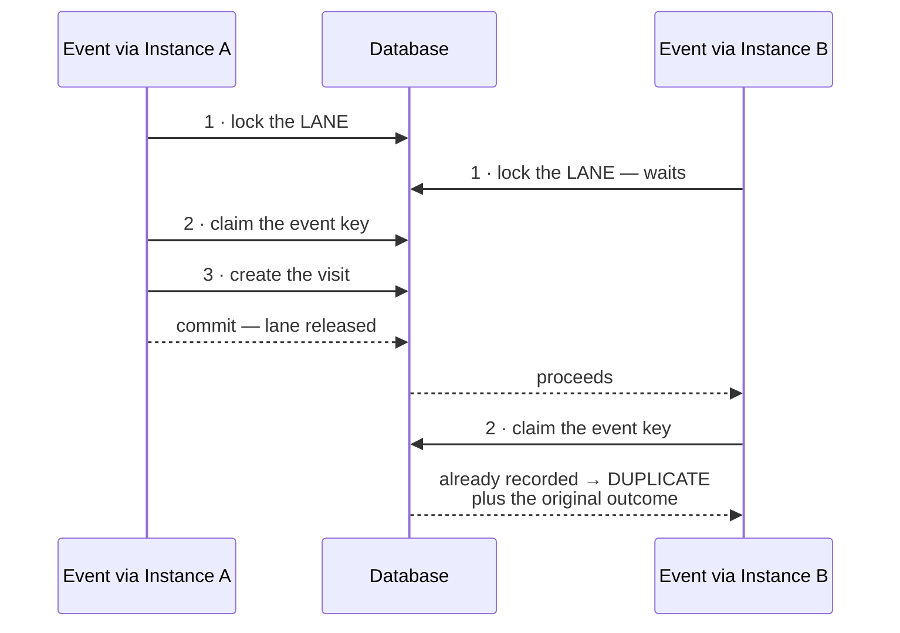

**The lock order is coarse before fine, on every path — lane first, then the event.** The
opposite order deadlocks: two events each claim their own key, then contend for the lane,
while each still holds locks the other needs. **That was found by measurement**, on an
eight-lane run that exhausted its retries until the order was inverted.

### 6.5 · Lane ownership at the edge

A camera addresses **one** endpoint, so one instance must own each lane.

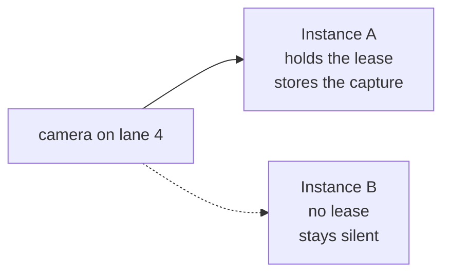

An instance receiving a packet for a lane it does not own **does not answer at all** —
answering would mean two instances answering one capture.

### 6.6 · The scope seam

Every read and write passes through it. The deny predicate is a named constant, with the
reason beside it in the code:

> *written as a constant so nobody "optimises" it away by skipping the `WHERE` clause when
> there is no scope. Skipping it is the bug: the query would return everything, and it
> would look like it was working.*

**No scope means zero rows — never all rows.** Writes are stricter: with no scope they
*throw*, rather than quietly matching nothing, because "zero rows updated" is
indistinguishable from "the rows had already moved on."

This replaces roughly **816 hand-written tenant conditions** in the previous generation,
where forgetting one was a cross-tenant leak with no single place to fix it.

## 7 · The workflow engine

Flowable is embedded and executes BPMN 2.0. Administrators author in ORCA's own visual
builder, and each published process is **compiled to BPMN at publish**.

**Only runtime's `execution` module may touch the engine's API** — a build check enforces
it. Everything else goes through `ProcessEngineGateway`.

Two engine facts worth knowing before designing anything around it:

- **A boundary timer on a service task cannot fire.** The job is created and deleted
  inside one transaction, so nothing else ever sees it. On a wait state it fires,
  survives a restart, and fires once.
- **Work-item creation and visit completion are engine event *listeners*, not steps in
  the process.** A step a designer could delete would produce a process that runs
  perfectly and leaves every visit open forever.

→ **`docs/CODE_PATTERNS.md`** §5 owns the confinement rule as it applies to writing code;
`docs/BPMN_EXECUTION_PROFILE.md` covers what the compiler may emit.

## 8 · Deployment and hosting

### 8.1 · The three profiles

**A deployment profile says which components run at an installation. It does not say how
many instances of each.** Those are two independent axes.

| Profile | What runs | For |
|---|---|---|
| **Site appliance** | Everything: core, runtime, edge, media, plus database, identity and a reverse proxy | The primary model — a server at the customer's facility that keeps gates moving **with no internet at all** |
| **Hosted tier** | Everything except the hardware-facing service, which has no hardware to face | Paired with sites, and serving the driver portal |
| **Thin edge** | The hardware-facing service alone, with a local buffer | Small or satellite gates, with the rest of the platform in a hosted tier |

### 8.2 · Where each service runs

| Service | Site appliance | Hosted tier | Thin edge |
|---|---|---|---|
| `orca-core` | ✅ | ✅ | not deployed |
| `orca-runtime` | ✅ | ✅ | not deployed — a thin-edge lane is driven by a hosted runtime |
| `orca-edge` | ✅ | **never** — no hardware to face in a data centre | ✅ **the only mandatory service** |
| `orca-portal` | read replica only | ✅ authoritative | not deployed |
| `orca-sync` | only when a tier is paired | ✅ | embedded inside `orca-edge` rather than run as a process |
| `orca-fleet` | **never at a customer site** | ✅ Lynxis operations only | — |
| `orca-media` | ✅ | not deployed | optional |

### 8.3 · Fully on-site — the primary model

Everything at the customer's facility. **No internet connection is required for a truck
to pass through a gate.**

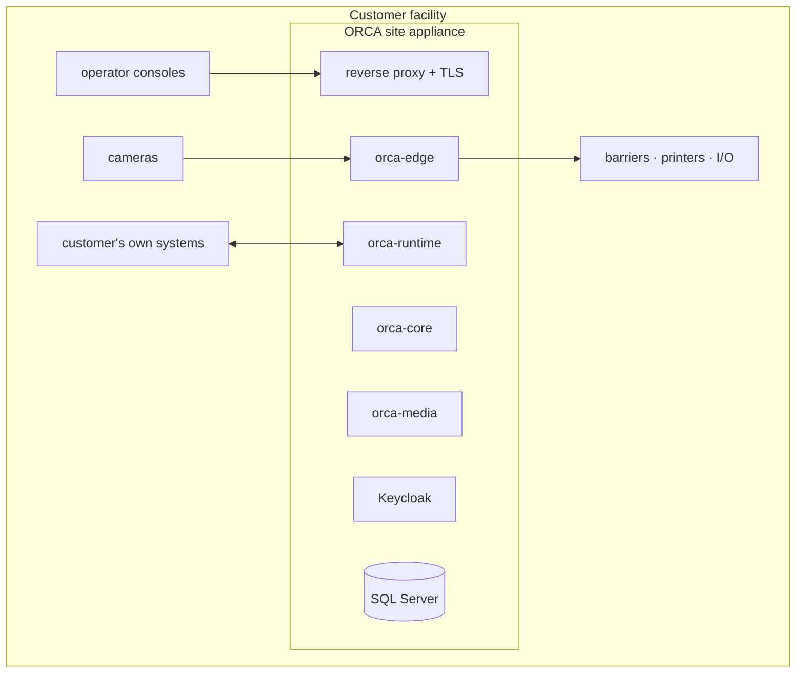

**Nothing leaves the facility.** The licence is a signed file verified locally, the
identity provider is on the box, and the customer's own systems are reached on their own
network.

### 8.4 · Hybrid — a site paired with a hosted tier

The common commercial shape: gates run locally and keep running during an outage, while
cross-site and cross-customer concerns live in a hosted tier.

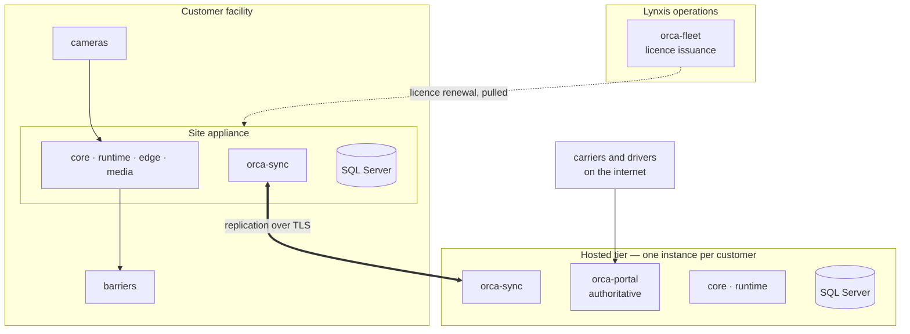

**Why the portal is in the tier and not at the site:** a haulage carrier delivers to
terminals owned by different companies and must not register once per terminal. That data
is cross-customer, so it cannot live in a single-tenant appliance database.

**What the site keeps when the link drops:** everything needed to run a gate. Replication
resumes when the link returns.

### 8.5 · Cloud-hosted with a thin edge

The closest thing to "everything in the cloud".

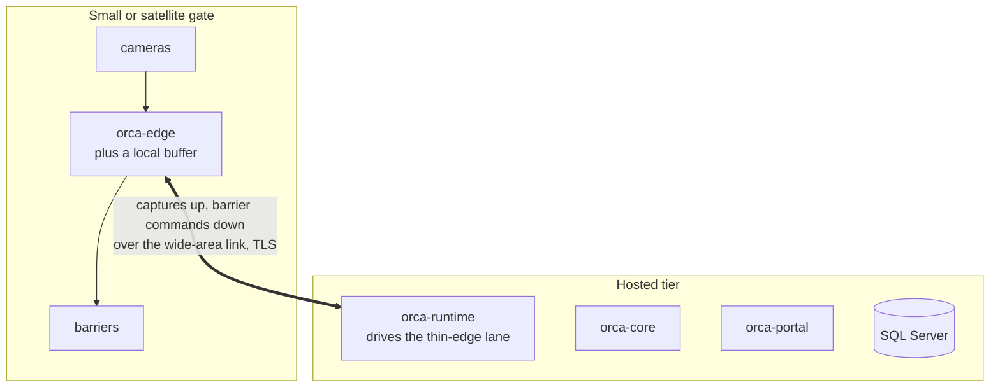

⚠️ **There is no profile in which nothing runs at the gate.** Cameras and barriers are
physical, so a hardware-facing component is always present — which is why `orca-edge` is
the *only mandatory service* on thin edge. "Fully cloud" means the thin-edge shape above,
not an empty gate.

⚠️ **The trade is explicit:** on thin edge, **the command that raises a barrier crosses
the wide-area link.** A site that must keep moving trucks through a network outage needs
the site-appliance or hybrid shape. This is a commercial decision, not a technical
preference.

### 8.6 · What crosses the network, and how it is secured

| Concern | Rule |
|---|---|
| **People** | Keycloak authenticates people — operators, drivers, a customer's own system on the partner API |
| **Services** | Service-to-service calls carry a **per-installation shared credential**, verified locally. **No service mints a token**, so the gate loop never depends on the identity provider being reachable |
| **Transport** | *"Internal" is a property of a deployment, not of a service.* On thin edge and hybrid, internal calls leave the host — so **any hop that leaves the host is over TLS terminated by the site's reverse proxy** |
| **Background work** | Every entry point that runs without a user — a relay, a scheduled job, a reconciler — enters an **explicit system context**. There is no path that runs with no identity |

### 8.7 · Licensing and instance count

A licence is a **signed artifact issued by Lynxis operations and verified locally at
startup**. No runtime path ever calls a Lynxis service to validate it.

It records how many instances may be active at a site, and **that limit is the
enforcement**: instances arbitrate through the database lease, so an instance beyond the
licenced count cannot acquire the right to work. **A cold standby on other hardware is a
supported arrangement, not a violation.** Machine identity is telemetry carried by the
heartbeat, never an enforcement input.

Renewal follows the deployment: a connected site pulls its renewed licence from fleet; an
offline site receives a file and installs it through the console.

### 8.8 · Upgrades

Where a site runs more than one instance, the platform supports a **rolling upgrade** —
one instance at a time, with the other serving. This requires a schema change to be
compatible with both versions for the duration of the upgrade, which is a discipline on
how migrations are written rather than a feature.

**A single-instance site takes a short planned outage to upgrade.** That is stated rather
than engineered around: a site needing zero-downtime upgrades needs a second instance.

### 8.9 · What runs today

The local stack is real and proven; the production install path is partly built. Stated
here so no reader assumes otherwise.

**Running today** — `deploy/docker-compose.yml` brings up SQL Server, Keycloak, a
customer-system stub and a device-host stub, plus three tools: `bootstrap` (database,
seven schemas, seven logins, grants), `verify-isolation` (36 checks proving each service
reaches only its own schema) and `demo-seed`.

**Designed, and not yet built:** release images and a registry, the reverse proxy and
TLS, licence verification at startup, and per-installation secrets provisioning.
`docs/deployment.md` Part 2 carries the step-by-step status.

## 9 · How the rules stay true

**Ten build checks. They fail the build, not a review.**

| Check | Refuses |
|---|---|
| Platform purity | A primitive naming a visit, lane, ticket, driver or truck |
| Module walls | A module reaching into another's internals |
| Scope seam | A `JdbcTemplate`, `EntityManager` or `DataSource` in a service class |
| Error envelope | A response that is not the shared envelope |
| Retention class | A traffic-growing table with no retention class |
| System context | A scheduled method that does not enter a system identity |
| Engine confinement | The engine API touched outside `execution` |
| Scope-leading index | A table whose index does not lead with the scope column |
| Contract interface | A controller implementing no generated interface |
| Internal surface | An internal endpoint outside `/internal/**` |

**This is the architecture written as executable constraints** — faster to read than the
architecture document, and it cannot go out of date.

Two habits go with them:

- **Contract first.** Change the OpenAPI document, regenerate, then make the code satisfy
  the generated interface. A contract change breaks the build until the code matches.
- **Watch a check fail before you trust it.** A check nobody has watched fail may not be
  wired in.

**What a test looks like here:**

> *"The outbox writes a row" is not a test — "killing the process between the two writes
> leaves neither" is.*

→ **`docs/CODE_PATTERNS.md`** §6 and §7 own the testing idioms and the full list of
anti-patterns the build already refuses.

---

## 10 · Where the detail lives

**This document is the entry point, not the authority on everything.** Each topic below
has exactly one owner — go there rather than trusting a summary, including this one. A
fact repeated in two documents is a fact that will eventually disagree with itself.

| For | Read | What it owns |
|---|---|---|
| **The shape a change takes** | `docs/CODE_PATTERNS.md` | The six-layer request path · the check-then-act guards · the four requirements of a migration · engine confinement · the anti-patterns the build refuses · what a test looks like here |
| **The primitives in depth** | `docs/PLATFORM_PRIMITIVES.md` | What each primitive is called in the literature, what actually gets built, how a service wires them, and what is deliberately *not* in `platform/` |
| **Where any file lives** | `docs/REPOSITORY_GUIDE.md` | The folder-by-folder structure and how the build is composed |
| **Setting up and running** | `docs/LOCAL_DEVELOPMENT.md` | The first hour, and **§6.1 — stop the services before the suite** |
| **One truck, in detail** | `docs/phase-1-demo.md` | The standing regression walkthrough, including deduplication and the admission race |
| **Rules that fail the build** | `AGENTS.md`, plus the nested ones | The binding rules, and the ten checks that enforce them |
| **The target design** | `ORCA_ARCHITECTURE.md` | The specification, and §B10 — what it guarantees and how each is verified |
| **What is deliberately undecided** | `ORCA_OPEN_QUESTIONS_REGISTER.md` | The open register. Consult it before concluding something was forgotten |

### 10.1 · The statements behind §6

Kept in this document because §6 is its own subject and these are the evidence for it.
The pattern they express — *how the caller learns what happened* — is owned by
`docs/CODE_PATTERNS.md` §2.

**Lease acquisition** — the whole decision in one statement, the new token returned in the
same round trip:

```sql
UPDATE service_lease
SET holder_id = ?, fence_token = fence_token + 1,
    acquired_at = SYSUTCDATETIME(), renewed_at = SYSUTCDATETIME(),
    expires_at  = DATEADD(millisecond, ?, SYSUTCDATETIME())
OUTPUT inserted.fence_token, inserted.expires_at
WHERE service = ? AND lease_name = ?
  AND (expires_at <= SYSUTCDATETIME() OR holder_id = ?)
```

**Renewal**, verifying the token inside the statement rather than before it:

```sql
UPDATE service_lease
SET renewed_at = SYSUTCDATETIME(),
    expires_at = DATEADD(millisecond, ?, SYSUTCDATETIME())
OUTPUT inserted.fence_token, inserted.expires_at
WHERE service = ? AND lease_name = ?
  AND holder_id = ? AND fence_token = ? AND expires_at > SYSUTCDATETIME()
```

**The outbox claim** — skip-locked, and ordered per key:

```sql
SELECT TOP (?) d.publish_seq
FROM outbox_delivery d WITH (UPDLOCK, READPAST, ROWLOCK)
JOIN outbox o ON o.publish_seq = d.publish_seq
WHERE d.consumer = ? AND d.status = 'PENDING'
  AND (d.claimed_until IS NULL OR d.claimed_until < SYSUTCDATETIME())
  AND d.publish_seq = (
        SELECT MIN(head.publish_seq) FROM outbox_delivery head
        JOIN outbox ho ON ho.publish_seq = head.publish_seq
        WHERE head.consumer = d.consumer AND head.status = 'PENDING'
          AND ho.ordering_key = o.ordering_key)
ORDER BY d.publish_seq
```

### 10.2 · The code these sections describe

Read in this order; `docs/CODE_PATTERNS.md` §8 carries the same list with its reasoning.

1. `platform/scope/…/JdbcScopeSeam.java` — §6.6, the seam every read passes through.
2. `platform/outbox/…/OutboxRelay.java` — §6.3, the claim and per-key ordering.
3. `platform/lease/…/JdbcLeaseManager.java` — §6.2, every statement guarded and
   server-side.
4. `services/orca-runtime/…/execution/domain/AdmissionService.java` — §6.4, one truck one
   visit, with the lock ordering found by measurement.
5. `services/orca-runtime/src/main/resources/processes/gate-visit.bpmn20.xml` — §4, the
   process the platform exists to run.
6. `build-checks/src/test/java/com/lynxis/orca/checks/` — §9, **all ten.**

**To run any of it yourself:** `docs/LOCAL_DEVELOPMENT.md`, top to bottom. It ends with a
truck through the gate, and its §6.1 carries the one rule that costs a session when
missed — the suite and the running services share the `runtime` schema.

---

*The code is the truth; this document is a guide to it. Where the two disagree, the code
is right and this is a defect — say so.*
